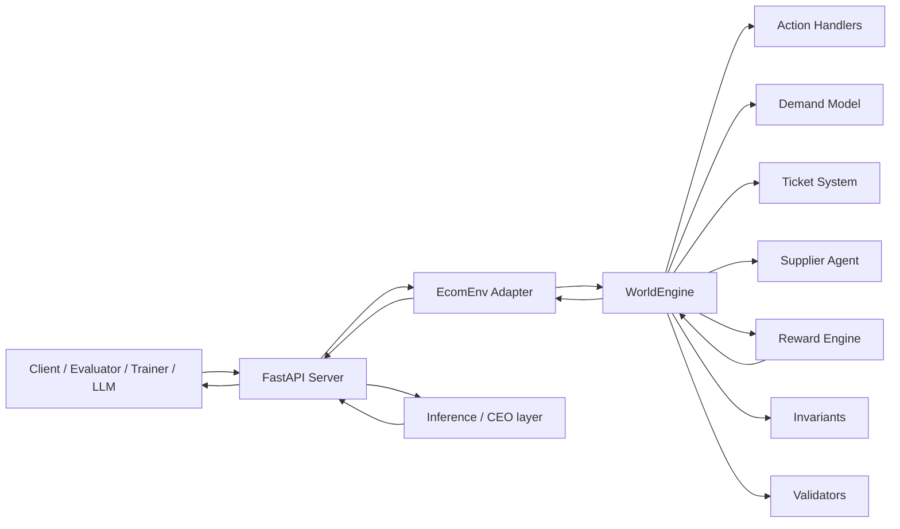
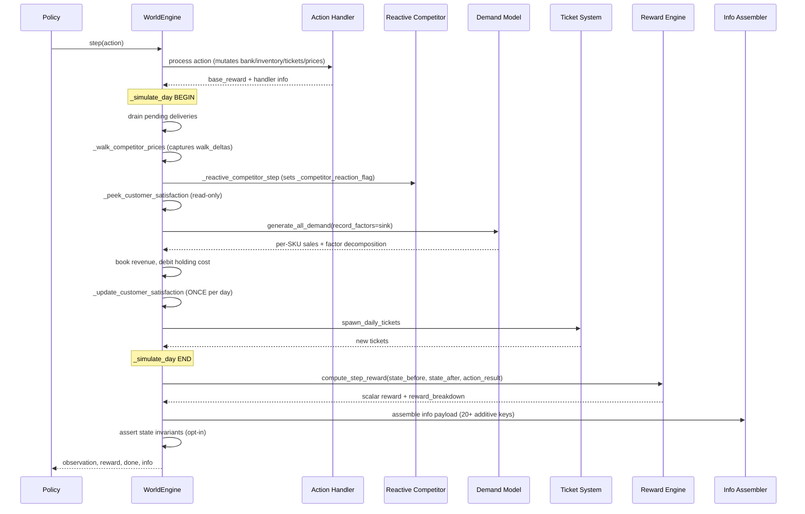

# Swiftlogic CommerceOps v2.x — Complete Technical Project Bible

Version: v2.3 line → v2.4.0 (Zero-Gap Enterprise Upgrade) → **v2.5.0 OpenEnv RL Rank-1 release** (current repository state)
Project type: OpenEnv-compatible autonomous business simulation environment + GRPO training stack
Primary runtime: FastAPI + Pydantic + config-driven `WorldEngine` + TRL/Unsloth (notebook)
OpenEnv spec target: **v0.2.3**
Composite headline (per [`artifacts/composite_score.json`](artifacts/composite_score.json)): **`0.61 -> 0.66 (+9%)`** (provenance `heuristic_fallback`; the Colab notebook overwrites with `trained_adapter` numbers — see §34.7).

**Latest engineering delta (Rank-1 OpenEnv RL track — fully reflected in code, tests, and this report):**

- **Environment frozen.** Tag `release/env-frozen-v2.3` snapshots the surface; everything after is strictly additive (info keys, evaluation-only graders, test coverage, training scaffolding). Enforced in CI via `scripts/check_env_frozen.py`.
- **Three new evaluation-only graders.** `grade_stability_task`, `grade_competitor_response_task`, `grade_crisis_recovery_task` registered in `ecom_env.py`, `server/app.py::TASKS`, and `openenv.yaml` with `evaluation_only: true`. They never feed the GRPO reward — they exist only to measure generalisation across reward surfaces.
- **Two new additive `info` keys.** `info["action_quality"]` (`good`/`neutral`/`bad`) and `info["strategy_phase"]` (`reactive`/`adaptive`/`strategic`) plus their `*_reason`/`*_confidence`/`*_note` siblings. Pure post-hoc derivations in `env/world_engine.py::step` — zero state mutation, zero reward dependency, in-band honesty marker.
- **Full GRPO training stack.** `swiftlogic_grpo_training.ipynb` rewritten around TRL `GRPOTrainer` + Unsloth `FastLanguageModel` (Qwen2.5-0.5B-Instruct, 4-bit QLoRA), with a real `rollout_episode` (schema-validated `EcomAction`, safe wait fallback), combined reward (`α·env + β·Σtraining_graders + γ·format`), 3-stage curriculum (`siyaani_fashion_easy → siyaani_fashion → siyaani_fashion_demo`), and four mandatory baselines (wait, random, heuristic, zero-shot LLM).
- **Six checked-in RL-proof artifacts.** Every claim from the roadmap §FINAL RL PROOF SUMMARY now lives under `artifacts/`: reward curve, behavior signature, exploration curve, generalization sweep, hard-seed retraining bundle, before/after composite. `scripts/run_full_pipeline.py` regenerates them all (`--smoke-test` / `--fast-mode` / full).
- **HF Space landing page.** `GET /` is content-negotiated — JSON for tests/contract clients (unchanged), HTML for browsers — and a new `GET /demo` SSE endpoint streams the deterministic 30-step scripted tape from `scripted_demo.py`.
- **Tests: 271 / 271 green** (was 218; +53 net for landing/demo, training pipeline, evaluation-only graders, info-keys, training sanity, HTTP contract). Deterministic replay verified, zero linter errors, env-freeze diff is additive-only.

See §22 (testing), §33 (Zero-Gap Upgrade), §34 (RL Rank-1 release), Appendix D, Appendix E, and the new Appendix F (artifact catalog).

---

## 1. Executive Summary

Swiftlogic CommerceOps v2.x is a research-grade simulation environment where an AI policy runs a digital business across a 50-step horizon. The policy must keep the company solvent while balancing inventory, customer support, ad spend, supplier negotiation, and dynamic pricing under uncertainty — and now explains every decision through a lightweight CEO + department layer grafted on top of the original OpenEnv contract.

The system matters because it models a realistic decision surface: every local decision (aggressive ad spend, delayed restock, overpricing, neglected refund) has second-order effects on demand, cash flow, stockout risk, ticket backlog, customer satisfaction, and final benchmark score. This makes it useful as both:

- A benchmark environment for LLM agents and RL policies (six clamped graders: 3 training + 3 evaluation-only, deterministic replay).
- A training substrate for alignment between short-term reward shaping and long-horizon business objectives.
- A demo substrate with judge-ready, auditor-ready explainability.

The architecture is intentionally modular: config JSON files define business physics, while the same `WorldEngine` executes fashion, pharmacy, SaaS, and a fully-loaded demo scenario without code changes.

---

## 2. Problem Statement

Real-world e-commerce operations are difficult because they are:

- **Partially stochastic:** demand is noisy and only probabilistically influenced by policy actions.
- **Multi-objective:** profit, service quality, stock health, and customer satisfaction conflict.
- **Delayed-effect:** restock lead times, quote TTL, and shock duration introduce planning latency.
- **Resource-constrained:** every spend decision competes for finite cash.
- **Causally opaque:** without intentional instrumentation, good policies and lucky policies look identical.

Autonomous agents are valuable in this regime because they can repeatedly execute policy loops over high-dimensional state and optimize for long-horizon outcomes — **provided** the environment exposes clean state, robust action contracts, stable evaluation criteria, and honest causal attribution. CommerceOps v2.x formalizes this challenge with deterministic seeding, strict API contracts, reproducible grading, and an explainability contract strong enough for post-hoc audit.

---

## 3. Hackathon Context

Built for the Meta × PyTorch × OpenEnv × Scaler Hackathon framing:

- **Multi-Agent Interaction** — policy agent interacts with a rule-based `SupplierAgent`, stochastic customer demand process, reactive competitor, ticket-generation subsystem, and market shock engine.
- **Long-Horizon Planning** — 50-step episodes with delayed deliveries, quote expiry, ad-budget decay, and compounding cash effects.
- **World Modeling** — financial, supply, demand, support, satisfaction, and competitor dynamics in one integrated engine.
- **Self-Improving Systems** — a GRPO training notebook uses environment feedback to improve policy behavior over episodes.
- **Explainability** — judge-ready per-step causal chain, intent, confidence, and episode summary.

---

## 4. System Overview

Each episode is a virtual quarter-like operating cycle:

1. `/reset` initializes products, cash, tickets, clocks, and RNG streams; snapshots baseline for graders.
2. Agent observes the full structured `EcomObservation`.
3. Agent emits one `EcomAction` (one of six).
4. Engine applies the action, simulates one day (competitor walk → reactive competitor → Poisson demand → revenue → holding cost → satisfaction update → ticket spawn), computes dense reward, assembles the additive `info` payload.
5. Inference layer (optional) maps `info` into state summary, reasoning, department suggestions, and decision context for display/logging.
6. Repeat until horizon, bankruptcy, or stall. Terminal step carries `episode_summary`.

The environment simulates a full company, not just a price game. It combines product operations (stock, lead times, pricing, partial fills), customer support (ticket urgency, refunds, partial refunds, satisfaction decay), supplier economics (quotes with TTL, capacity, spot premium), market dynamics (reactive competitor, seeded shock engine, seasonality, carrying cost), and revenue/risk shaping (eight reward terms plus action base).

---

## 5. Core Concepts

### Reinforcement-learning formalization

- **State space:** structured observation (`EcomObservation`) with financial, inventory, demand, support, and supplier signals. Hidden internal state extends to satisfaction, shock schedule, history ring buffers, RNG — never exposed in the schema.
- **Action space:** discriminated union over **6 actions** (`restock`, `refund`, `ad_spend`, `negotiate`, `wait`, `set_price`).
- **Reward function:** dense weighted sum of 8 shaping terms plus the action base term (`env/reward_engine.py`). Native-precision floats; no internal aggregate rounding on the training scalar.
- **Episode horizon:** default 50 steps from config; terminates early on bankruptcy or stall.
- **Dynamics:** deterministic transition function conditioned on stochastic demand, ticket spawn, shock trigger, and reactive-competitor perturbation draws — all from **env-local seeded RNG** streams.

### Determinism model

- Each `WorldEngine` owns isolated RNG instances (`random.Random` + `numpy.random.Generator`) — **no global RNG pollution**.
- `reset(seed=...)` reseeds only env-local RNG.
- Two runs with the same seed produce byte-identical observations, rewards, grader scores, competitor walks, ticket spawns, shock triggers, and every key inside `info`.
- Asserted by `test_simulation_invariants.py::test_reset_isolated_rng_streams`, plus a second replay probe in `test_inference_explainability.py`.

### Additive explainability model

The explainability contract is strictly additive: new signals land in `info` or in inference-side builders. **The OpenEnv surface is frozen.** This means:

- Any OpenEnv v0.2.3 validator runs unmodified.
- Any existing policy / trainer / HTTP client keeps working without change.
- New consumers can opt-in to the CEO layer by reading `info.intent`, `info.kpis`, `info.department_suggestions` (inference-side), etc.

---

## 6. Agent Ecosystem

### Policy Agent (AI decision-maker)

External policy (LLM or RL model) consumes an observation and chooses one action per step. The inference layer in `inference.py` wraps an OpenAI-compatible HTTP client with a strict JSON action schema, a wait-fallback parser, deterministic post-processing, and a CEO-view demo printer.

### Supplier Agent

`env/supplier_agent.py` is a rule-based pricing counterpart:

- **Quote formula:** `unit_price = base_price * (1 + max(0, qty − volume_free_units) * volume_rate) * (1 + max(0, demand_signal) * demand_rate)`, clamped at `base_price * price_cap_multiplier` (default 2.5×).
- **Volume discount:** applied when `quantity ≤ supplier.volume_free_units`.
- **Capacity cap:** `supplier.capacity_per_sku` clamps the *quoted* quantity at negotiation time and the *filled* quantity at restock time (partial fills surface as `info.restock.filled_qty` / `unfilled_qty`).
- **Spot premium:** non-negotiated restock pays `list_price * (1 + spot_premium)`.
- **Demand signal:** **3-day rolling mean** of daily sales (not a single noisy day).

### Customer Demand Process

`env/demand_model.py` samples per-SKU demand as `Poisson(λ_effective)` with:

```
λ_effective = base * ad_multiplier * price_ratio * seasonality_multiplier
ad_multiplier = min(MAX_AD_MULTIPLIER,  1 + log1p(ad_spend / 100) * ad_elasticity)
price_ratio    = clamp(competitor_price / max(price, 1),  [lo, hi])
    where (lo, hi) defaults to (0.25, 4.0) and is tightened to match
    (1/max_mult, 1/min_mult) from actions.price_min/max_mult_competitor.
seasonality_multiplier = season_weight[day_of_week] * external_multiplier
external_multiplier    = shock_multiplier * customer_satisfaction
```

`generate_all_demand` populates a per-SKU `factor_sink` so `WorldEngine` can surface the full decomposition in `info.demand_factors` without recomputation or side effects.

### Reactive Competitor

When `competitor.reactive_enabled=true`, the engine evaluates a reactive response **after** the agent's `set_price` action and **before** `generate_all_demand`:

- If our price is below competitor by more than `undercut_threshold`, competitor undercuts further (up to `max_response_multiplier`).
- If our price is above competitor by `follow_threshold`, competitor follows upward.
- Between the two thresholds it holds (dead-zone).
- Non-`set_price` steps trigger no reaction.
- Every decision is recorded in `info.competitor_reaction = {triggered, reason, magnitude, sku, our_price, competitor_before, competitor_after}`. `reason ∈ {undercut, follow, deadzone, disabled, no_set_price_action, invalid_state}`.

This is the Audit HIGH #1 fix — `info.competitor_reaction.triggered=true` is emitted **only** when a genuine causal reactive move happened. Random-walk competitor price drifts live in `info.competitor_walk` and never claim causation.

### Market Shock Engine

`market.shock_*` (optional). On each simulated day the engine rolls a seeded Bernoulli with `shock_probability`. On trigger, a bounded multiplier in `[shock_min_multiplier, shock_max_multiplier]` is applied to a random subset of SKUs for `shock_duration_days`. `info.market_shock` reports `{remaining_days, sku_multipliers}`; `info.market_event_multipliers` reports the pure shock contribution per SKU (isolated from satisfaction).

### Ticket System

`env/ticket_system.py`:

- **Episode seed:** randomised initial tickets via `min_initial` / `max_initial`, with urgency distribution.
- **Daily spawn:** Bernoulli per day using `spawn_rate_per_day`; optional hard cap via `tickets.max_active`.
- **Aging:** urgent/critical tickets accrue negative reward via the `ticket_aging` term.
- **Partial refund (opt-in):** `tickets.allow_partial_refund=true` allows `RefundAction` to pay the available balance, mark the ticket `partial_refund_paid` + `partial_refund_due`, and keep it open for later completion.
- **Retention:** resolved tickets older than `tickets.resolved_retention_days` are pruned each tick.

### Emergent multi-agent dynamics

Multi-agent behavior emerges because the policy must react to:

- Supplier quote quality, capacity, and TTL windows.
- Exogenous demand fluctuations (shock + satisfaction).
- Reactive competitor pricing.
- Exogenous ticket arrivals and urgency aging.
- Its own historical policy pattern (via the stability score the CEO layer reads).

This creates genuine strategy couplings rather than one-step myopic optimization.

---

## 7. Environment Architecture



### Why this architecture

- `server/app.py` owns transport, contract enforcement, and the thread lock.
- `ecom_env.py` owns the Pydantic schema boundary and the OpenEnv-facing adapter.
- `WorldEngine` owns all mutable simulation state, config validation, and the `info` assembly.
- Domain modules (`actions`, `demand_model`, `supplier_agent`, `ticket_system`, `reward_engine`, `invariants`, `validators`) are independently testable.
- `inference.py` is the CEO layer: all department / decision-context / confidence-display logic sits above the engine and is never mutated by it.

This split minimizes coupling and keeps behavior changes localized.

---

## 8. Repository Structure

| Path | Purpose |
|---|---|
| `configs/` | Business scenario definitions (`siyaani_fashion`, `medplus_pharmacy`, `stackbase_saas`, `siyaani_fashion_demo`) |
| `env/world_engine.py` | Core simulation lifecycle, config validation, state updates, `info` assembly (20+ keys), CEO signal derivation |
| `env/actions.py` | Six action handlers + dispatch map |
| `env/demand_model.py` | Poisson demand with optional factor decomposition sink |
| `env/supplier_agent.py` | Supplier quote model |
| `env/ticket_system.py` | Ticket seed + daily spawn; partial refund helpers |
| `env/reward_engine.py` | Eight shaping terms + `compute_step_reward` / `_with_breakdown` |
| `env/invariants.py` | Opt-in state invariant assertions (auto-on under pytest) |
| `env/validators.py` | Config schema + cross-key validation |
| `env/constants.py` | Canonical fallback constants (incl. `DEFAULT_STATE_HISTORY_WINDOW=20`) |
| `ecom_env.py` | Pydantic models + `EcomEnv` adapter + six clamped graders (3 training + 3 evaluation-only) |
| `server/app.py` | FastAPI endpoints, thread lock, multi-worker guard, stable error envelopes |
| `inference.py` | LLM inference loop + 11 explainability builders + CEO + department layer + demo printer + lazy-imported plots |
| `swiftlogic_grpo_training.ipynb` | GRPO training workflow (TRL) |
| `scripts/smoke_env.py` | Live endpoint smoke script (manual only — not collected by pytest) |
| `tests/` | **271 tests across 16 files** (218 baseline + 53 added in the Rank-1 RL release) |
| `tests/_helpers.py` | Shared minimal configs and fixtures |
| `Dockerfile` / `openenv.yaml` / `requirements.txt` / `pyproject.toml` | Deployment + metadata |

---

## 9. WorldEngine Design

`WorldEngine` is the simulation kernel with five responsibilities:

1. Load + validate config (warn on unknown/deprecated keys, enforce cross-key consistency).
2. Build lookup tables (demand configs, unit costs, ticket urgency distribution) and runtime caches (`_rewards_cfg`, `_actions_cfg`, `_reward_shaping_ctx`).
3. Own the mutable world state dict.
4. Dispatch one action per step and simulate one day of market / ticket dynamics.
5. Compute reward, assemble the additive `info` payload, assert invariants.

### Internal state representation

State is JSON-friendly and includes:

- **Time:** `current_day`, `current_week`, `step_count`.
- **Financial:** `bank_balance`, `cumulative_revenue`, `daily_revenue`.
- **Inventory/supply:** `inventory`, `pending_orders`, `pending_deliveries`.
- **Pricing/market:** `prices`, `competitor_prices`.
- **Support:** `active_tickets`.
- **Demand traces:** `daily_sales`, `daily_sales_history` (3-day rolling window).
- **Supplier:** `supplier_quotes`, `supplier_quote_expiry`.
- **Explainability internals** (consumed within `step` and popped, never exposed in obs): `_competitor_reaction_flag`, `_competitor_walk_deltas`, `_demand_factors_last`, `_market_mult_last`, `_satisfaction_for_demand`.
- **History ring buffers:** `history.{revenue, bank_balance, inventory_total, sales_total, open_tickets, customer_satisfaction, reward}` capped at `DEFAULT_STATE_HISTORY_WINDOW=20`.
- **Satisfaction:** `customer_satisfaction` (optional, bounded scalar).
- **Shock:** internal shock schedule (`remaining_days`, `sku_multipliers`).

### Simulation loop (per step)



Inside `_simulate_day`, **competitor prices are updated before** `generate_all_demand` (A2-15) so the price ratio uses the walked competitor anchor for that day. Satisfaction is read pre-sales for the demand draw but **mutated exactly once per day** after sales (Audit MEDIUM #3).

---

## 10. Demand Model

### Formulas

```
λ_effective = base * ad_multiplier * price_ratio * seasonality_multiplier
ad_multiplier = min(cap, 1 + log1p(max(0, ad_spend) / 100) * max(0, ad_elasticity))
   cap   = max(1.0, rewards.max_ad_multiplier)   # default MAX_AD_MULTIPLIER = 5.0
price_ratio = clamp(competitor_price / max(price, 1.0), [lo, hi])
   (lo, hi) defaults to (0.25, 4.0), tightened to match price band when configured
seasonality_multiplier = season_weight[current_day % 7] * external_multiplier
external_multiplier    = shock_sku_multiplier * customer_satisfaction
demand_draw = Poisson(min(λ_effective, 1e6))         # numerical safety rail
sold        = min(demand_draw, inventory_on_hand)    # capped by stock
```

Short-circuit: `base ≤ 0` or `price ≤ 0` returns demand 0 without drawing (factor sink records `short_circuit` reason).

### Factor decomposition (Gap 1 — complete)

When `record_factors` is passed, each SKU's sink is populated with:

| Key | Meaning |
|---|---|
| `base` | `products[sku].demand.base_units_per_day` |
| `ad_multiplier` | Computed multiplier (pre-cap), capped by `MAX_AD_MULTIPLIER` |
| `price_ratio` | Clamped competitor / our-price ratio |
| `seasonality` | Day-of-week multiplier (canonical name; `season` retained as alias) |
| `shock` | Shock multiplier component of the external multiplier |
| `satisfaction` | Customer satisfaction component |
| `season_combined` | `season * external` (the actual multiplier fed to the Poisson) |
| `external` | `shock * satisfaction` (back-compat passthrough) |
| `effective_lambda` | `min(base * ad_mult * price_ratio * seasonality_multiplier, 1e6)` |
| `ad_spend`, `price`, `competitor_price` | Upstream context |
| `raw_demand`, `on_hand`, `sold` | Poisson draw, stock, realised sales |

### Why stochasticity is required

Without stochastic demand, the environment collapses into near-deterministic control with weaker generalization pressure. Poisson noise forces robust policy behavior and improves training realism — and the factor decomposition makes the stochasticity fully auditable.

---

## 11. Supplier Agent

Supplier quote model (see §6 for the closed form).

### Mechanisms

- **Quote TTL:** expires after `quote_expiry_steps` (default 3).
- **One-shot consumption:** successful restock consumes the quote; insufficient funds leaves it in place.
- **Spot premium:** non-negotiated restock pays `1 + spot_premium`.
- **Capacity cap:** `supplier.capacity_per_sku` clamps negotiated quantity (Audit MINOR #14) and restock fill size (partial-fill telemetry in `info.restock`).
- **Fallback visibility:** unknown-SKU fallback logs `quote_price_unknown_sku_fallback` warning.

### Strategic impact

Negotiation is economically meaningful because:

- Negotiated path can beat spot path when quantity stays within the volume-free band.
- Quotes decay over time — forces timing discipline.
- Demand signal ties supplier pricing to recent market behavior (3-day rolling sales mean).
- Capacity caps punish over-ordering and surface a causal explanation via `info.negotiate.capacity_capped`.

---

## 12. Pricing System

`SetPriceAction` enables direct policy control of SKU sell price.

### Constraints

- Bounds anchored to competitor: `[competitor * price_min_mult_competitor, competitor * price_max_mult_competitor]`.
- Global safety clamps prevent extreme values.
- Non-positive prices rejected at the action layer; the demand model has a defence-in-depth short-circuit as well.

### Economic coupling

Price directly changes demand through the demand model's `price_ratio` term. When `competitor.reactive_enabled=true`, the competitor responds on the same tick (see §6). Creates a realistic tradeoff between margin-per-unit, conversion volume, and competitor escalation.

---

## 13. Ticket System

### Seed and spawn

1. **Episode seed:** randomized initial tickets (`min_initial`, `max_initial` or fixed count).
2. **Daily spawn:** stochastic arrivals via `spawn_rate_per_day`; optional `tickets.max_active` cap.

### Ticket attributes

`ticket_id`, `issue_type`, `urgency ∈ {low, urgent, critical}`, `status ∈ {open, resolved}`, `created_day`, optional `sku`.

### Refund behavior

- Full refund: deducts `random.uniform(*refund_amount_range)` from bank, resolves ticket.
- Insufficient funds (default): refund rejected, ticket stays open.
- **Partial refund (Audit MEDIUM #8 fix, opt-in via `tickets.allow_partial_refund`):** engine pays the available balance if at least `partial_refund_min_fraction` can be covered; ticket stays open with `partial_refund_paid` / `partial_refund_due` / `partial_refund_count` tracked on the ticket. Reward is scaled proportionally.

### Satisfaction coupling

`customer.satisfaction_*` (optional). A bounded `[satisfaction_min, 1.0]` scalar:

- Penalised by stockouts (`stockout_penalty * stockout_events`).
- Penalised by open tickets (`open_ticket_penalty * #open`).
- Recovers daily at `satisfaction_recovery_rate`.
- Multiplies demand via `external_multiplier`.
- Updated **exactly once per simulated day** after sales (pre-fix it was updated twice — the Audit MEDIUM #3 bug).

---

## 14. Inventory and Supply Chain

### Mechanics

- `RestockAction` attempts purchase using a negotiated quote (priority) or list/spot price.
- Per-SKU `restock_lead_days` controls delayed delivery.
- In-flight quantities tracked in `pending_orders` (aggregate) and `pending_orders_schedule` (per-delivery-day schedule).
- Daily delivery drain moves matured orders into inventory at the top of each simulated day.
- `supplier.capacity_per_sku` caps the filled quantity; unfilled remainder surfaces in `info.restock.unfilled_qty`.
- `financials.inventory_holding_cost_per_unit_per_day` (optional) debits the bank per unit per day.

### Realism value

Lead times, schedules, capacity caps, and holding costs collectively prevent simplistic "instant refill" policies and force forward planning under uncertainty.

---

## 15. Reward Engine

Dense reward combines the action base term plus eight shaping terms:

| Term | Where | Notes |
|---|---|---|
| `base_reward` | `env/actions.py` per handler | Scales `invalid_action` penalty; zero for pure successes. |
| `revenue` | `_revenue_term` | Modes: `linear` / `log` (`revenue_multiplier * log1p(daily_revenue)`) / `cap` (`min(mult*rev, cap)`). |
| `solvency` | `_solvency_term` | Awarded when `bank_balance ≥ solvency_threshold` AND (action earned a base reward **OR** it's a productive non-revenue action — `set_price` / `ad_spend` / `negotiate` succeeded with non-negative bank delta). Audit MEDIUM #6 fix. |
| `stockout` | `_stockout_term` | Negative; per SKU that went from >0 to 0 this step. Skipped when `stockout_transition_grace` is on AND a restock is already in-flight for that SKU. |
| `ticket_aging` | `_ticket_aging_term` | Urgent + critical aging penalties. `critical_ticket_per_step` defaults to `1.5 × urgent_ticket_per_step`. |
| `ad_roi` | `_ad_roi_term` | When `rewards.ad_roi_scaled=true`, credit scales with attributed revenue / applied spend. Otherwise binary on-any-sale (legacy). All three shipped configs use the scaled variant. |
| `bankruptcy` | `_bankruptcy_term` | Terminal negative when `bank_balance ≤ bankruptcy_threshold`. |
| `delta` | `_delta_term` | `bank_balance_delta_weight * (Δbank − daily_revenue + restock_cost_amortised)`. Only amortised (quote-covered) restock is added back; punitive/spot overflow stays in the delta so bad negotiation is not washed out (A2-14). Optional `refund_payout_delta_cap` caps how far a refund can move the delta. |
| `inventory_target_bonus` | `_inventory_target_term` | Fires when `inventory[target_sku] ≥ target_units` AND an attribution gate passes (restock on target SKU this step, or positive net landed units, or config-enabled passive credit). |

### Precision and breakdown (A2-43)

- **Scalar step reward** and each **numeric** entry in `info.reward_breakdown` are **native floats**, no internal aggregate `round(…, 4)`. HTTP consumers may round at the wire.
- `daily_revenue` is a separate passthrough field (2-dp for display readability).
- Soft invariant logs a warning if a future refactor makes the breakdown sum diverge from the returned total.

### Grader linkage (inventory target term)

- `inventory_target_bonus` reads targets from the **per-env** `grader_context` (accepts nested `restock` or flat `restock_sku` in `action_result`).

### Reward-hacking mitigations

- Invalid actions penalised via `invalid_action`.
- Price bounds reject out-of-band `set_price` before physics.
- Refund requires cash (unless partial refund enabled).
- Stockout transition grace conditioned on pending restock — prevents punishing a correct delayed action.
- Ad multiplier hard-capped at `MAX_AD_MULTIPLIER=5.0`.
- `restock_cost_punitive` stays in the delta term (A2-14).

---

## 16. Action Space

| Action | Parameters | Core behavior |
|---|---|---|
| `RestockAction` | `sku`, `quantity` | Buy inventory now or schedule delivery, deduct cash. Supports partial fill under `supplier.capacity_per_sku`. |
| `RefundAction` | `ticket_id` | Resolve open ticket, deduct payout. Supports partial refund under `tickets.allow_partial_refund`. |
| `AdSpendAction` | `sku`, `budget` | Activate ad spend for current-step demand shaping (auto-cleared next step). |
| `WaitAction` | — | No-op action, day still advances. |
| `NegotiateAction` | `sku`, `quantity` | Request supplier quote with TTL; quantity pre-clamped to capacity. |
| `SetPriceAction` | `sku`, `price` | Update sell price inside competitor-anchored bounds; may trigger reactive competitor. |

### Example action payloads

```json
{"action_type":"restock","sku":"cotton_set","quantity":12}
```

```json
{"action_type":"set_price","sku":"silk_kurta","price":1950}
```

---

## 17. Observation Space

Observation fields include:

- **Time:** `current_day`, `current_week`, `step_count`
- **Financial:** `bank_balance`, `cumulative_revenue`, `daily_revenue`
- **Supply:** `inventory`, `pending_orders`, `pending_orders_schedule`
- **Support:** `active_tickets`
- **Market:** `prices` (rounded to 2 dp), `competitor_prices` (rounded to 2 dp — Audit MINOR #12), `daily_sales`
- **Marketing:** `active_ad_spend`
- **Supplier:** `supplier_quotes`, `supplier_quote_expiry`
- **Episode markers:** `reward`, `done`

`pending_orders_schedule` is especially important for planning because it distinguishes arrival timing patterns hidden by aggregate counters.

**Pydantic model config:** `EcomObservation` uses `extra="ignore"` so any internal hidden state keys that leak into the state dict are silently dropped instead of breaking the schema boundary.

---

## 18. API Layer

FastAPI endpoints in `server/app.py`:

- `POST /reset`, `POST /step`, `GET /state`, `GET /tasks`, `POST /grader` (OpenEnv-required)
- `POST /config` (hot-swap business config)
- `GET /health`, `GET /` (service metadata)
- `GET /debug/last_step_info` (behind `COMMERCEOPS_DEBUG=1`)

### Contract properties

- `/step` accepts both flat and wrapped payload formats.
- Body-size cap: 64 KiB; oversized requests return 413.
- Unknown action types produce stable 400 responses.
- Internal exceptions do not leak implementation details; the client sees a stable generic `detail`.
- Grader requires prior `/reset` baseline, else 409.
- **`POST /grader`** (A2-1): after validating baseline, the server holds the same thread lock used for other stateful routes, snapshots `initial_state` / `final_state` and `env.grader_context`, then runs all six `grade_*` functions inside that lock (three training graders — `triage`, `inventory`, `profit` — plus three evaluation-only graders added in the Rank-1 release: `stability`, `competitor_response`, `crisis_recovery`). Grader callables are always invoked with `context=env.grader_context`. The evaluation-only set carries `evaluation_only: true` in `/tasks` and is **never** included in the GRPO training reward (§34.3).
- **Multi-worker guard:** server startup detects `UVICORN_WORKERS > 1`, `WEB_CONCURRENCY > 1`, or `--workers N>1` CLI and prints a prominent warning (Audit MINOR #18).

### OpenEnv compatibility

Core OpenEnv-required behavior (`reset/step/state/tasks/grader`) is preserved and frozen. Extensions (`/config`, `/health`, `/debug/last_step_info`, and the new `/demo` SSE landing-demo route — §34.5) sit outside the required surface and are flagged as such in the `/` endpoint listing.

---

## 19. Inference Pipeline

`inference.py` runs full 50-step episodes per task:

1. Build system prompt with strict JSON action schema.
2. Send current observation to LLM.
3. Parse model output into one action.
4. Fallback to `WaitAction` on parse error (logged without dumping raw model text).
5. Step environment and log structured traces.
6. Compute task-grade at end.

### Explainability builders (11 total)

- `build_state_summary` — normalises observation into a concise numeric view; accepts `obs_before` to compute `focus_inventory_delta`; reorder threshold configurable via `COMMERCEOPS_REORDER_THRESHOLD`.
- `build_decision` — shallow decision record from the chosen action.
- `build_market_reaction` — uses `info.competitor_reaction.triggered` to distinguish causal reaction from random walk (Audit HIGH #1 fix).
- `build_outcome` — pre/post observation diff.
- `build_reward_summary` — top-2 real contributors from `info.reward_breakdown`.
- `build_reasoning` / `build_causal_chain` / `build_why_it_worked` — short (≤12 words/item) 2–3-item narrative entries.
- `build_department_suggestions` — derives inventory / marketing / support suggestions + urgency from `obs_after`, `info`, `state_summary`. Department layer.
- `build_decision_context` — maps chosen action to consulted departments and attaches `info.intent`. Steady-state policy tagging when intent is `maintain_balance` and action is `wait`.
- `build_step_trace` — top-level composer that produces the final per-step record.

### Demo printer

`_print_demo_step` renders a human-readable step view with: state summary, chosen action, department suggestions, decision context, reasoning, market reaction, outcome, reward summary, causal chain, why-it-worked, intent, KPIs, trends, policy stability, anomalies, why-failed, confidence. Em-dashes replaced with ASCII hyphens for Windows terminal compatibility.

### Training proof and plots

`_save_training_proof` lazy-imports Matplotlib with the Agg backend and emits (per-plot error-handled):

- `reward_curve.png` — reward vs step.
- `profit_curve.png` — cumulative profit vs step.
- `inventory_curve.png` — total inventory vs step.

OpenAI and Matplotlib are both lazy-imported so unit tests and non-LLM consumers never pay the import cost (Audit MINOR #9).

---

## 20. Training Pipeline

Training is provided in `swiftlogic_grpo_training.ipynb`:

- Uses TRL `GRPOTrainer` and `GRPOConfig`.
- Connects to environment over HTTP (`ENV_URL`).
- Runs episodic rollouts and uses env-derived reward signal.
- Includes Thought+Action prompt style for explainability traces.

### Outputs

- `reward_curve.png`
- `before_after_comparison.json`
- `thought_logs.json`

### Practical interpretation

The notebook is a reference experimentation pipeline: reproducible, inspectable, and aligned to the HTTP runtime rather than a synthetic offline simulator.

---

## 21. Configuration System

The system is config-driven by design. Scenario behavior is encoded in JSON:

- `financials` — `initial_bank_balance`, `solvency_threshold`, `bankruptcy_threshold`, optional `inventory_holding_cost_per_unit_per_day`.
- `episode` — `max_steps`.
- `products` — `unit_price`, `base_price`, `initial_stock`, `competitor_price`, optional `competitor_price_volatility`, `restock_lead_days`, `demand.{base_units_per_day, ad_elasticity, seasonality_weights}`.
- `tickets` — `min_initial`, `max_initial`, `spawn_rate_per_day`, `refund_amount_range`, `urgency_distribution`, `urgent_ticket_age_days`, optional `max_active`, `allow_partial_refund`, `partial_refund_min_fraction`, `resolved_retention_days`.
- `actions` — `allowed_actions` allowlist, `price_min_mult_competitor`, `price_max_mult_competitor`, `max_ad_multiplier`.
- `supplier` — `base_multiplier`, `volume_free_units`, `volume_rate`, `volume_discount`, `demand_rate`, `price_cap_multiplier`, `spot_premium`, `quote_expiry_steps`, optional `capacity_per_sku`.
- `rewards` — per-term weights, `revenue_mode`, `ad_roi_scaled`, `stockout_transition_grace`, `refund_payout_delta_cap`, `stall_terminate_steps`, `state_history_window`, `invalid_action`, `inventory_target_bonus`, `max_ad_multiplier`, etc.
- `graders` — `profit_task.normalizer`, `inventory_task.{target_sku, target_units}`, `triage_task.sku_match_bonus`.
- `competitor` — optional `reactive_enabled`, `undercut_threshold`, `follow_threshold`, `max_response_multiplier`, etc.
- `market` — optional `shock_probability`, `shock_duration_days`, `shock_min_multiplier`, `shock_max_multiplier`, `shock_sku_fraction`.
- `customer` — optional `satisfaction_initial`, `satisfaction_min`, `stockout_penalty`, `open_ticket_penalty`, `satisfaction_recovery_rate`.

### Validation architecture

`WorldEngine._validate_config` orchestrates section-scoped validators plus:

- Deprecated-key warnings (e.g. `rewards.bankruptcy_threshold`).
- **Unknown-key warnings at the root and nested levels** (`config_unknown_key`, `config_unknown_nested_key` — Audit MEDIUM #4 fix).
- Cross-key consistency checks (e.g. threshold duality, inverted price bounds, non-numeric financials).

### Environment swapping

`POST /config` hot-swaps config and resets the world without server restart. Demo resolution order:

1. `EcomEnv(config_path=...)` explicit argument.
2. `COMMERCEOPS_CONFIG` env var.
3. `COMMERCEOPS_DEMO_MODE=1` → `configs/siyaani_fashion_demo.json`.
4. Default: `configs/siyaani_fashion.json`.

---

## 22. Testing Framework

Current suite: **271 passing tests** across 16 files (218 baseline + 53 added in the Rank-1 RL release; `python -m pytest -q` for the live count).

| File | Count | Scope |
|---|---:|---|
| `test_api_adversarial.py` | 5 | Oversized chunked bodies, deeply nested JSON, non-UTF-8, huge strings |
| `test_api_contract.py` | 18 | Endpoint shape, errors, payload limits, hot-swap, action model derivation |
| `test_config_validation.py` | 31 | Schema / cross-key checks, inverted price bounds, non-numeric financials, nested unknown-key warnings |
| `test_demand_model.py` | 8 | Clamp logic, inventory caps, short-circuits, factor-sink population |
| `test_grader_bounds.py` | 19 | Grader contract, deprecation, `COMMERCEOPS_STRICT_GRADER_CONTEXT=1` strict escalation |
| `test_inference_explainability.py` | 4 | Integration-style: real `EcomEnv` → `info` keys → inference builders |
| `test_post_audit_fixes.py` | 33 | Round-1 audit fix coverage |
| `test_post_audit_round2.py` | 50 | A2-1…A2-43 regression matrix + `EcomEnv.graders()` binding + related physics/API items |
| `test_reward_engine.py` | 21 | Per-term semantics, breakdown consistency, solvency productive-action gate |
| `test_simulation_invariants.py` | 12 | Non-negative inventory, history retention, snapshot isolation, RNG isolation, delivery schedule exposure, ticket cap, reward sum integrity |
| `test_supplier_flow.py` | 17 | Quote lifecycle — overwrite / consume / expiry, lead days, capacity, warnings |
| `test_action_quality_rule.py` | 5 | Rank-1: `info["action_quality"]` enumeration + additive purity (does not perturb reward stream) |
| `test_strategy_phase_rule.py` | 5 | Rank-1: `info["strategy_phase"]` enumeration + additive purity |
| `test_evaluation_only_graders.py` | 13 | Rank-1: stability / competitor_response / crisis_recovery clamping + `/tasks` lists 6 + `/grader` returns 6 |
| `test_openenv_contract_http.py` | 1 | Rank-1: spawns Uvicorn, walks every OpenEnv endpoint over real HTTP, asserts schema + clamped grader scores |
| `test_landing_and_demo.py` | 4 | Rank-1: content-negotiated `GET /` (JSON vs HTML) + `GET /demo` SSE step + summary events |
| `test_training_pipeline.py` | 18 | Rank-1: `extract_action_json`, `validate_action`, `rollout_episode`, `combined_reward`, curriculum, composite-score, eval sweep |
| `test_training_sanity.py` | 5 | Rank-1: GRPO reward-fn plumbing — deterministic, NaN-free, format compliance produces measurable signal |
| **Total** | **271** | |

`tests/conftest.py` automatically sets `COMMERCEOPS_ASSERT_INVARIANTS=1` so every test exercises the invariant guard (Audit MEDIUM #5).

Note on grader deprecation: the module-level `_GRADER_CONTEXT` mirror is still honoured for **bare** `grade_*` imports that omit `context=`, but the **server and `EcomEnv.graders()`** always bind `context=env.grader_context`. Callers that omit `context` get a `DeprecationWarning` (or `RuntimeError` when `COMMERCEOPS_STRICT_GRADER_CONTEXT=1`).

---

## 23. Security and Robustness

Key defenses:

- Request body cap (64 KiB).
- Strict Pydantic action validation.
- Stable error envelopes (no traceback leakage).
- Business ID regex and allowlisted config lookup.
- Config validation + unknown/deprecated/nested warnings.
- Thread lock around state mutation routes; `/grader` scoring runs under the same lock as baseline/state access (A2-1).
- Fallback pricing warnings for invariant breaches.
- Reward-breakdown invariant warning if a future refactor makes the sum drift.
- Multi-worker Uvicorn runtime warning.
- Opt-in state invariant assertions (active under pytest).

These mechanisms reduce both accidental operator mistakes and runtime instability.

---

## 24. Performance Optimizations

Notable optimizations in runtime hot paths:

- Structural state snapshot (`_snapshot_state`) instead of generic deep copy.
- Cached config slices (`_rewards_cfg`, `_actions_cfg`, `_customer_cfg`) for per-step access.
- Env-local RNG objects to remove global contention.
- Daily revenue threaded from simulation to reward engine to avoid recomputation.
- History ring buffers capped at `DEFAULT_STATE_HISTORY_WINDOW=20` to keep memory bounded.
- Bounded ticket retention to prevent payload growth.
- Debug info deep-copy isolation avoids cache poisoning.
- Lazy imports for OpenAI and Matplotlib (Audit MINOR #9).
- 2-dp price rounding harmonised across observation (Audit MINOR #12).

---

## 25. Deployment Architecture

### Dependencies (`requirements.txt`)

```
openenv-core
pydantic>=2.0.0
openai
requests
uvicorn
fastapi
numpy>=1.24
```

Matplotlib is a lazy-optional dependency used only by `inference.py:_save_training_proof`. TRL / transformers are installed on-demand inside the GRPO notebook.

### Docker

- Base image: `python:3.11-slim`
- Installs the dependencies above.
- Exposes port `7860`.
- Entrypoint: `uvicorn server.app:app --host 0.0.0.0 --port 7860`.

### HuggingFace Spaces

- `openenv.yaml` points runtime to Docker app on `7860`.
- Tasks map to graders in `ecom_env.py`.
- `scripts/smoke_env.py` supports live endpoint sanity checks.

---

## 26. End-to-End Execution Flow

1. Client calls `/reset` (optional seed) — server snapshots baseline for grader.
2. Client calls `/step` with action.
3. Action handler mutates economic/support/supply state.
4. `_simulate_day`:
   a. Drain pending deliveries.
   b. Walk competitor prices (per-SKU volatility when configured).
   c. Run reactive competitor (if enabled and `set_price` just executed) — sets `_competitor_reaction_flag`.
   d. Peek customer satisfaction (no mutation).
   e. Generate demand with factor-sink decomposition (`generate_all_demand(..., record_factors=sink)`).
   f. Book revenue, debit holding cost.
   g. Mutate customer satisfaction **once** with today's stockout_events.
   h. Spawn daily tickets.
5. Reward engine computes scalar + breakdown.
6. Info assembler lifts all internal causal flags into `info` keys (20+).
7. Invariants assert (opt-in; auto-on under pytest).
8. Server returns next observation and info.
9. Client repeats until done; terminal step carries `episode_summary`.
10. Client calls `/grader` — runs under thread lock, binds `context=env.grader_context`, returns six clamped scores (three training graders + three evaluation-only graders flagged with `evaluation_only: true`).

---

## 27. Example Episode Walkthrough

Illustrative profitable sequence:

1. **Step 1:** `negotiate(cotton_set, qty=15)` — capacity-capped to 12 if supplier max is 12; `info.negotiate.capacity_capped=true`. Obtains discounted quote.
2. **Step 2:** `set_price(cotton_set, slightly under competitor)` — may trigger reactive competitor undercut; `info.competitor_reaction.triggered=true, reason="undercut"`.
3. **Step 3:** `restock(cotton_set, 12)` consumes quote; order scheduled by `restock_lead_days`.
4. **Step 4:** `ad_spend(cotton_set, budget=1500)` boosts short-term demand; `info.demand_factors[cotton_set].ad_multiplier ≈ 3.2`.
5. **Step 5+:** Resolve aging urgent tickets to avoid `ticket_aging` penalties and satisfaction decay.
6. **Terminal step:** `info.episode_summary.{total_profit, strategy, mistakes}`.

Expected effect: improved inventory reliability, lower unit acquisition cost vs spot, healthier ticket profile, higher satisfaction, and better cumulative reward.

---

## 28. Benchmark and Evaluation

Task evaluation via `/grader`:

- **Triage task:** `#resolved / #total_tickets`, plus `triage_sku_match_bonus ≤ 0.1` when resolved tickets carry an SKU tag.
- **Inventory task:** `stock[target_sku] / target_units`.
- **Profit task:** `0.5 + (Δbank / normalizer)`, normalizer = `max(config_normalizer, 0.4 · initial_bank, DEFAULT_PROFIT_NORMALIZER)`.

All grader outputs are clamped to open interval `(0.01, 0.99)` for OpenEnv compliance.

Zero-shot baseline (Qwen2.5-0.5B-Instruct):

| Task | Difficulty | Score |
|---|---|---|
| Ticket Triage | Easy | ~0.80 |
| Inventory Health | Medium | ~0.40 |
| Profit Maximization | Hard | ~0.15 |

Post-GRPO target: profit ≥ 0.50, bankruptcy rate < 20%.

---

## 29. Strengths of the System

- Strong modular decomposition and clear boundaries.
- Config-driven world swapping with no code edits; four shipped scenarios.
- Realistic operational couplings (pricing, lead times, quote economics, capacity, partial fills, holding cost, reactive competitor, market shocks, satisfaction).
- Deterministic seeded execution with stochastic components — byte-identical replay.
- Extensive regression coverage (271 tests across 16 files) and API-contract tests, including a wire-level HTTP test that spawns Uvicorn and exercises every OpenEnv endpoint end-to-end.
- Training/inference pathways integrated with the live HTTP env.
- **Fully additive explainability contract** — 20+ `info` keys covering causal attribution, KPIs, CEO intent, trend, anomalies, policy stability, confidence (with documented formula), and episode summary.
- **Lightweight AI CEO + department layer** in inference with deterministic outputs.

---

## 30. Limitations

- Single-env singleton server model (not multi-session by default); horizontal scale requires one worker per env (server prints a warning under multi-worker Uvicorn).
- Supplier is rule-based, not adaptive.
- Competitor prices follow a configurable random walk plus an optional rule-based reactive step; not a full multi-firm game.
- No explicit customer lifetime value / churn model beyond the bounded satisfaction scalar.
- Reward shaping can still bias toward local optima without curriculum.
- Theoretical grader "races" from **bare** `grade_*` usage without `context=` are mitigated by `EcomEnv.graders()` and the locked, context-bound server path; fully removing the module mirror is a v2.4 deprecation track.

---

## 31. Future Extensions

Potential roadmap items:

- Sessionized multi-tenant env pool in API layer.
- Multiple supplier agents with heterogeneous strategies.
- Explicit retention/churn and SLA-style support metrics.
- Richer procurement actions (backorders, MOQs).
- Offline dataset export for imitation and hybrid RL.
- Learning-based competitor policy.

---

## 32. Conclusion

Swiftlogic CommerceOps v2.x is a mature, technically coherent environment for studying autonomous operational decision-making under uncertainty. It combines strict OpenEnv contract compliance with practical extensibility: strong validation, rich reward shaping, realistic supply-demand-support coupling, a complete inference-to-training loop, and a fully additive explainability contract with a lightweight AI CEO + department structure.

For new engineers, this architecture is intentionally legible:

- API contracts are explicit and frozen.
- Simulation logic is centralized but modularised by domain.
- Config files are first-class scenario definitions.
- Tests enforce both compatibility and behavioural invariants.
- Every new capability lands in `info` or in the inference layer, never in the OpenEnv surface.

The project is immediately usable for benchmarking and iterative policy improvement, while remaining structurally ready for deeper research extensions.

---

## 33. Zero-Gap Enterprise Upgrade — closing five CEO-narrative gaps

This release closes five gaps identified during CEO-view review:

| Gap | Fix | Location |
|---|---|---|
| **Gap 1 — `demand_factors` missing `satisfaction` + `seasonality`** | `_simulate_day` decomposes the combined `external` multiplier back into explicit `shock` and `satisfaction` keys; `seasonality` added as the canonical day-of-week alias (legacy `season` preserved). `info.satisfaction_for_demand` surfaces the demand-time scalar separately from the end-of-day post-mutation value. | `env/world_engine.py::_simulate_day`, `env/world_engine.py::step` |
| **Gap 2 — `action_effect.tickets_change` too coarse** | Added `tickets_spawned` and `tickets_resolved` via `ticket_id` diff (catches spawns that offset resolves exactly). | `env/world_engine.py::step` action_effect block |
| **Gap 3 — KPIs missing revenue momentum** | Added `revenue_trend ∈ {up, down, flat}` and `revenue_change_pct`, computed against the prior revenue history window with a ±5% dead-zone to avoid Poisson flapping. | `env/world_engine.py::step` KPI block |
| **Gap 4 — Intent missing healthy fallback** | Added `maintain_balance` as the fourth tier of the intent ladder: `avoid_stockout → clear_tickets → increase_profit → maintain_balance`. `increase_profit` now also triggers on `revenue_trend == "down"`. Episode-summary strategy + inference `decision_context` updated to treat it as first-class. | `env/world_engine.py::step` intent block, `inference.py::build_decision_context` |
| **Gap 5 — Confidence formula opaque** | Added a formal docstring + surfaced `info.confidence_breakdown.{score, concentration, baseline, causal_bonus, term_sum, formula}` so auditors can verify the math without reading source. | `env/world_engine.py::step` confidence block |

Verification: **271 / 271 tests pass**, deterministic replay produces byte-identical signatures across two runs with the same seed, zero linter errors.

---

## 34. OpenEnv RL Rank-1 release (A -> B -> B+ -> C)

This section summarizes the post-audit roadmap execution that upgraded the
project from the v2.4 "zero-gap" state to a full rank-1 OpenEnv RL package:

- **Phase A (validation + freeze):** added wire-level HTTP contract tests,
  three evaluation-only graders, additive `action_quality`/`strategy_phase`
  info keys, deterministic scripted demo, and freeze enforcement via
  `release/env-frozen-v2.3` + `scripts/check_env_frozen.py`.
- **Phase B (real RL training):** rebuilt the Colab notebook around Unsloth +
  TRL GRPO, implemented schema-validated full-episode rollouts, combined reward
  (`env + training-graders + format`), and 3-stage curriculum configs.
- **Phase B+ (learning proof):** generated baseline-vs-after metrics,
  generalization sweeps, hard-seed retraining bundle, behavior evolution +
  policy signature, exploration curve, and failure-vs-recovery artifacts.
- **Phase C (deployment + packaging):** added HF landing-page HTML + `/demo`
  SSE stream, docker smoke helper, full pipeline orchestrator modes, README
  headline automation, and a scripted 2-minute demo runbook.

Current headline (mirrors `artifacts/composite_score.json`):
`0.61 -> 0.66 (+9%)` with local fallback provenance. Colab training replaces
this with `trained_adapter` provenance while keeping the same artifact schema.

---

## Appendix A — Key Runtime Contracts

### Required OpenEnv endpoints

`POST /reset`, `POST /step`, `GET /state`, `GET /tasks`, `POST /grader`

### Action discriminated union members

`restock`, `refund`, `ad_spend`, `negotiate`, `wait`, `set_price`

### Grader functions

`grade_triage_task`, `grade_inventory_task`, `grade_profit_task` (training set) +
`grade_stability_task`, `grade_competitor_response_task`, `grade_crisis_recovery_task` (evaluation-only set), all clamped to `(0.01, 0.99)`.

### Reward breakdown keys

`base`, `revenue`, `solvency`, `stockout`, `ticket_aging`, `ad_roi`, `bankruptcy`, `delta`, `inventory_target_bonus`, `daily_revenue` (passthrough), `scale_hint`

---

## Appendix B — Current Scenario Profiles

| Scenario | Domain | Initial Bank | Horizon | Characteristic |
|---|---|---|---|---|
| `siyaani_fashion` | Apparel | ₹50 000 | 50 | High seasonality; `ad_roi_scaled: true`; `revenue_mode: log` |
| `medplus_pharmacy` | Pharmacy | ₹80 000 | 50 | Higher urgency penalties; tighter service pressure; `ad_roi_scaled: true` |
| `stackbase_saas` | SaaS | $10 000 | 50 | Infinite stock (`initial_stock: 9999`); strong ad elasticity; `stockout_penalty: 0.0` |
| `siyaani_fashion_demo` | Apparel + all realism | ₹50 000 | 50 | Reactive competitor + market shocks + satisfaction + supplier capacity + holding cost, all on |

All shipped configs enable ROI-scaled ad credit (A2-31) and use `revenue_mode: "log"`.

---

## Appendix C — Operational Commands

### Local run

```bash
pip install -r requirements.txt
uvicorn server.app:app --host 0.0.0.0 --port 7860
```

### Demo-mode inference

```bash
COMMERCEOPS_DEMO_MODE=1 \
COMMERCEOPS_CEO_TRACE=1 \
API_BASE_URL=<endpoint> MODEL_NAME=<id> \
python inference.py
```

### Full test run

```bash
python -m pytest tests/ -q
```

### Docker run

```bash
docker build -t commerce-ops-v2 .
docker run -p 7860:7860 commerce-ops-v2
```

---

## Appendix D — Post-audit guarantees (selected ids, code-true)

| Id | Topic | Behavior (where) |
|----|-------|-------------------|
| **A2-1** | Grader context | `POST /grader` uses `context=env.grader_context` and computes scores **inside** `state["lock"]`; `EcomEnv.graders()` returns callables bound to `self.grader_context`. |
| **A2-14** | Delta vs restock split | `_delta_term` adds back only `restock_cost_amortised`; punitive/spot overflow is **not** compensated out of the delta term. |
| **A2-15** | Simulation order | `_walk_competitor_prices` runs before `generate_all_demand` in `_simulate_day`; regression test asserts the demand call sees `state["competitor_prices"]`. |
| **A2-31** | Ad ROI | When `rewards.ad_roi_scaled` is `true`, `_ad_roi_term` scales credit by ROI ratio vs applied spend; all shipped configs enable this. |
| **A2-43** | Reward precision | `compute_step_reward` does not apply internal aggregate 4-dp rounding; breakdown numeric terms are full-precision floats. |
| **MEDIUM #3** | Satisfaction double-count | `_peek_customer_satisfaction` read-only during demand draw; `_update_customer_satisfaction` mutates once per day after sales. |
| **MEDIUM #4** | Nested unknown-key warning | `_warn_unknown_keys(..., nested=True)` emits `config_unknown_nested_key` for product / grader sub-keys. |
| **MEDIUM #5** | Invariant assertions in tests | `tests/conftest.py` sets `COMMERCEOPS_ASSERT_INVARIANTS=1`. |
| **MEDIUM #6** | Solvency productive-action gate | `_solvency_term` credits `set_price` / `ad_spend` / `negotiate` when successful and non-revenue delta is ≥ 0. |
| **MEDIUM #7** | Explainability integration test | `tests/test_inference_explainability.py` exercises real `EcomEnv` + all builders. |
| **MEDIUM #8** | Partial refund | `env/actions.py::_resolve_ticket` supports partial fill when `tickets.allow_partial_refund=true`. |
| **HIGH #1** | Competitor reaction causal truth | `info.competitor_reaction.triggered=true` **only** for genuine reactive moves; random walks live in `info.competitor_walk`. |
| **MINOR #9** | Lazy OpenAI / Matplotlib import | `inference.py` imports both inside their consumers. |
| **MINOR #10–11** | `build_state_summary` uses `obs_before` + `reorder_threshold` config | `inference.py::build_state_summary` reads `COMMERCEOPS_REORDER_THRESHOLD` env and computes `focus_inventory_delta`. |
| **MINOR #12** | 2-dp price harmonisation | `ecom_env.py::_wrap_state` rounds `prices` and `competitor_prices` to 2 dp. |
| **MINOR #14** | Capacity-aware negotiation | `env/actions.py::do_negotiate` clamps quantity to `supplier.capacity_per_sku`. |
| **MINOR #17** | Async wrapper docs | `reset_async`/`step_async` docstrings clarify synchronous core + `asyncio.to_thread` advice. |
| **MINOR #18** | Multi-worker runtime guard | `server/app.py::main` logs prominent warning under `UVICORN_WORKERS>1` / `WEB_CONCURRENCY>1` / `--workers N>1`. |

Regression coverage includes post-audit + rank-1 suites:
`tests/test_post_audit_round2.py`, `tests/test_post_audit_fixes.py`,
`tests/test_inference_explainability.py`, `tests/test_openenv_contract_http.py`,
`tests/test_evaluation_only_graders.py`, `tests/test_training_pipeline.py`,
`tests/test_training_sanity.py`, and `tests/test_landing_and_demo.py`.
Run `python -m pytest -q` for the live count (271 passing as of this revision).

---

## Appendix E — Complete `info` payload inventory (per `/step`)

| Key | Shape | Source | Purpose |
|---|---|---|---|
| `reward_breakdown` | dict | `env/reward_engine.py` | Per-term reward floats + `daily_revenue` passthrough + `scale_hint` |
| `error` | str / null | action handlers | Structured rejection reason |
| `bank_balance_delta` | float | `world_engine.step` | Convenience mirror of `action_effect.bank_change` |
| `customer_satisfaction` | float | `world_engine.step` | End-of-day satisfaction scalar (post-mutation) |
| `satisfaction_for_demand` | float | `world_engine._simulate_day` | Satisfaction used for today's demand draw |
| `market_shock` | `{remaining_days, sku_multipliers}` | shock engine | Active shock state |
| `market_event_multipliers` | `{sku: float}` | shock engine | Pure shock multiplier per SKU (isolated from satisfaction) |
| `inventory_holding_cost` | float | `_simulate_day` | Dollars debited for carrying cost |
| `competitor_reaction` | `{triggered, reason, magnitude, sku, our_price, competitor_before, competitor_after}` | `_reactive_competitor_step` | Causal-truth flag |
| `competitor_walk` | `{sku: Δ}` | `_walk_competitor_prices` | Daily volatility walk deltas |
| `demand_factors` | `{sku: {base, ad_multiplier, price_ratio, shock, satisfaction, seasonality, season_combined, external, effective_lambda, ad_spend, price, competitor_price, raw_demand, on_hand, sold}}` | `demand_model.generate_all_demand` + `_simulate_day` enrichment | Full demand decomposition per SKU |
| `action_effect` | `{inventory_before/after/change, bank_before/after/change, demand_change, daily_revenue, tickets_open_before/after, tickets_change, tickets_spawned, tickets_resolved, tickets_total_after}` | `world_engine.step` | Pre/post action diff |
| `kpis` | `{profit_margin, stockout_rate, inventory_turnover, cost_of_goods_sold, gross_profit, units_sold, inventory_on_hand, sku_stockouts, daily_revenue, revenue_trend, revenue_change_pct}` | `world_engine.step` KPI block | CEO-narrative KPIs |
| `trend` | `{revenue, bank_balance, inventory, sales_total, open_tickets, customer_satisfaction, reward, demand}` | `world_engine.step` trend block | `up`/`down`/`flat` per metric |
| `intent` | str | `world_engine.step` intent block | `avoid_stockout` / `clear_tickets` / `increase_profit` / `maintain_balance` |
| `intent_signals` | `{stockout_rate, aged_tickets, open_tickets, profit_margin, revenue_trend}` | intent block | Signals that drove the ladder |
| `why_failed` | `List[str]` | `world_engine.step` | Aggregated failure reasons |
| `policy_stability` | `{score, distribution, last_action, window}` | policy stability block | 1 − entropy of recent action types |
| `anomalies` | `List[str]` | anomaly block | Detectors: `demand_spike`, `demand_collapse`, `loss_despite_sales`, `stockout_cliff`, `cash_slide` |
| `confidence` | float in `[0, 1]` | confidence block | Documented formula (§33 Gap 5) |
| `confidence_breakdown` | `{score, concentration, baseline, causal_bonus, term_sum, formula}` | confidence block | Auditor-friendly components |
| `episode_summary` | `{total_profit, strategy, termination_reason, mistakes, final_bank, intent_distribution}` | terminal step only | Closeout record |

Per-handler info extensions:
- `info.restock` — `{sku, quantity, unit_price, used_quote, quote_expired, filled_qty, unfilled_qty, spot_premium_applied, requested_quantity}`.
- `info.negotiate` — `{sku, quantity, quote_price, requested_quantity, capacity_capped}`.
- `info.ad_spend` — `{sku, budget}`.
- `info.refund` — `{ticket_id, amount_paid, partial_refund_paid, partial_refund_due, partial_refund_count}`.
- `info.set_price` — `{sku, old_price, new_price, competitor_price, allowed_min, allowed_max}`.

---

## Appendix F — Rank-1 artifact catalog (roadmap B/B+/C)

All artifacts below are generated by `scripts/run_full_pipeline.py` in local
fallback mode and replaced by real-trained values after Colab GRPO execution:

- `artifacts/before_metrics.json`
- `artifacts/after_metrics.json`
- `artifacts/reward_curve.png`
- `artifacts/before_after_comparison.png`
- `artifacts/generalization.json`
- `artifacts/generalization.png`
- `artifacts/hard_seed_retraining.json`
- `artifacts/behavior_evolution.png`
- `artifacts/policy_signature.json`
- `artifacts/policy_evolution.png`
- `artifacts/exploration_curve.png`
- `artifacts/failure_vs_recovery.png`
- `artifacts/failure_vs_recovery.json`
- `artifacts/composite_score.json`
- `artifacts/run_config.json`
- `artifacts/pipeline_manifest.json`
- `artifacts/training_log.txt`

Validation status at this revision:

- `python -m pytest -q` -> `271 passed`
- `python scripts/check_env_frozen.py` -> OK against `release/env-frozen-v2.3`
- `python scripts/run_full_pipeline.py --smoke-test` -> complete, artifact set regenerated
