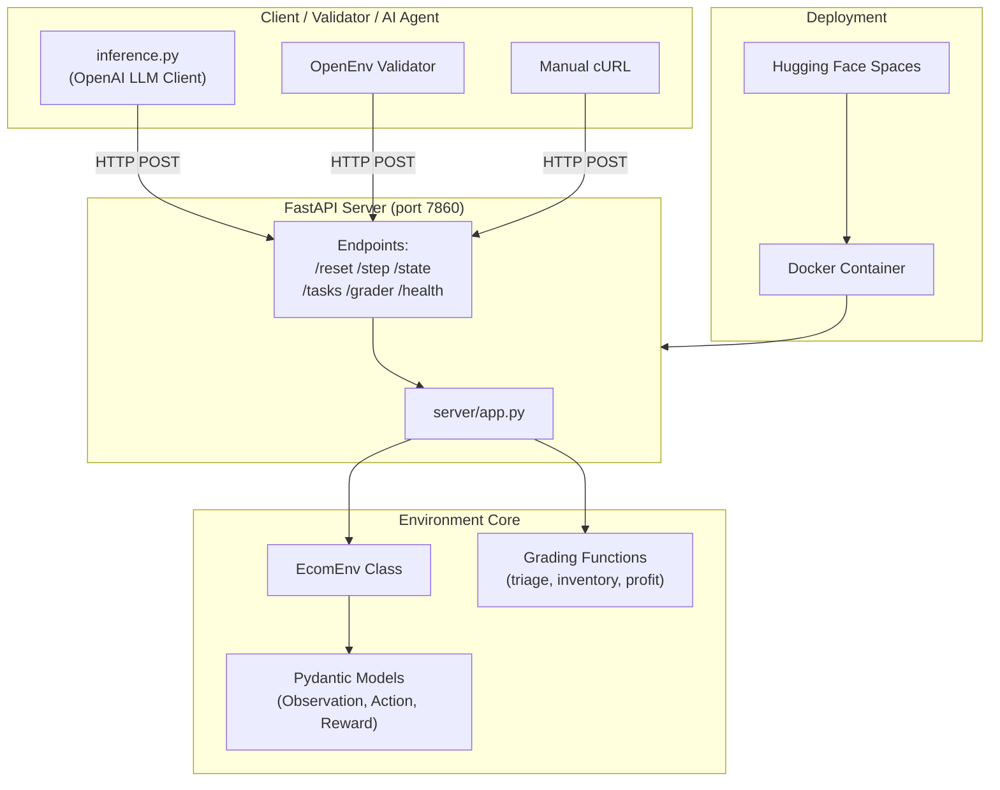
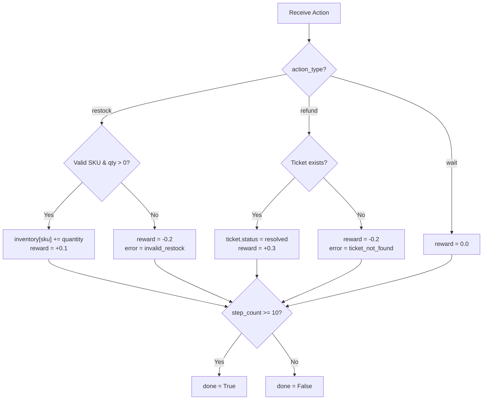
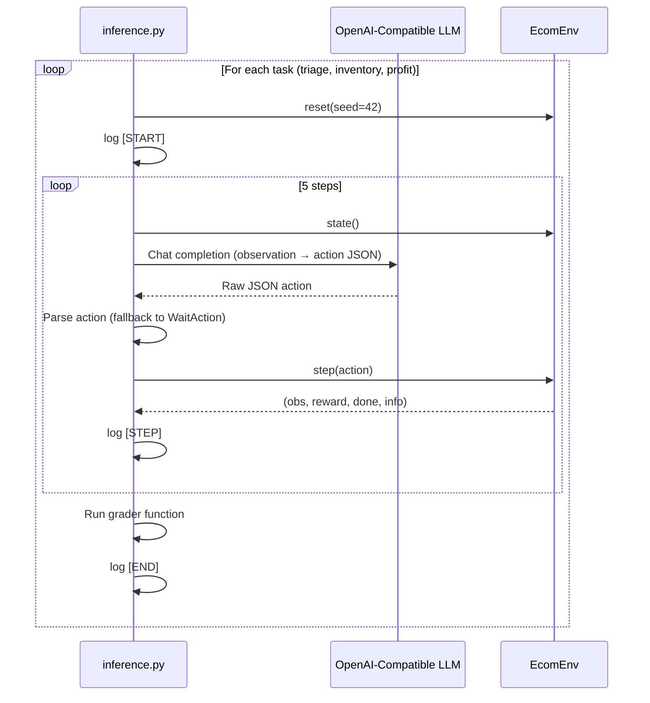

# Swiftlogic CommerceOps v2 — Comprehensive Project Report

> **Project Name:** `commerce-ops-v2` · **Version:** 2.0.0  
> **Hackathon:** Meta × PyTorch × OpenEnv × Scaler Grand Finale (April 25–26, 2026)  
> **Framework:** OpenEnv v0.2.3  
> **Date:** April 2026  

---

## Table of Contents

1. [Problem Statement](#1-problem-statement)
2. [Solution Overview](#2-solution-overview)
3. [Architecture & System Design](#3-architecture--system-design)
4. [Repository Structure](#4-repository-structure)
5. [Data Models (Pydantic Schemas)](#5-data-models-pydantic-schemas)
6. [Environment Core — `ecom_env.py`](#6-environment-core--ecom_envpy)
7. [Server & API Layer — `server/app.py`](#7-server--api-layer--serverappppy)
8. [Inference Pipeline — `inference.py`](#8-inference-pipeline--inferencepy)
9. [Grading System](#9-grading-system)
10. [Task Definitions](#10-task-definitions)
11. [Containerization & Deployment](#11-containerization--deployment)
12. [Validation & Testing](#12-validation--testing)
13. [APIs Used](#13-apis-used)
14. [Configuration Files](#14-configuration-files)
15. [Workflow — End-to-End](#15-workflow--end-to-end)
16. [Use Cases](#16-use-cases)
17. [Merits](#17-merits)
18. [Demerits & Limitations](#18-demerits--limitations)
19. [Future Scope](#19-future-scope)
20. [Conclusion](#20-conclusion)

---

## 1. Problem Statement

Modern e-commerce operations involve a complex interplay of **inventory management**, **customer support**, and **financial optimization**. Human operators struggle to make optimal decisions across all three simultaneously, especially under time constraints.

**The core challenge:** Can an autonomous AI agent operate a digital storefront — managing inventory, resolving customer tickets, and maximizing profit — better than a naive strategy, within a fixed decision horizon?

This project was built for the **Meta × Scaler OpenEnv Hackathon**, which requires participants to create standardized reinforcement learning (RL) environments that:

- Conform to the **OpenEnv v0.2.3 specification**
- Expose a deterministic HTTP API for automated evaluation
- Include multi-difficulty grading tasks
- Run inside a Docker container on **Hugging Face Spaces** (≤ 2 vCPU, 8 GB RAM)

---

## 2. Solution Overview

**Commerce Ops v1** is a lightweight, deterministic RL environment that simulates a real-world e-commerce storefront (themed around an ethnic wear brand, *Siyaani*). An AI agent must make sequential decisions across a 10-step "business cycle" to:

| Goal | Mechanism |
|------|-----------|
| **Maintain reputation** | Resolve customer support tickets via `RefundAction` |
| **Manage supply chain** | Keep stock levels healthy via `RestockAction` |
| **Maximize profit** | Preserve and grow a limited `bank_balance` |

The environment is evaluated across **three difficulty tiers** (Easy, Medium, Hard) with deterministic grading functions that return continuous scores in the `(0.01, 0.99)` range.

---

## 3. Architecture & System Design



### Layer Breakdown

| Layer | Component | Purpose |
|-------|-----------|---------|
| **Data Layer** | Pydantic Models | Schema validation, serialization, type safety |
| **Logic Layer** | `EcomEnv` class | State management, action processing, reward calculation |
| **Evaluation Layer** | Grading functions | Task-specific scoring against initial/final states |
| **API Layer** | FastAPI server | HTTP interface for OpenEnv framework compatibility |
| **Inference Layer** | `inference.py` | LLM-driven agent loop with structured logging |
| **Deployment Layer** | Docker + HF Spaces | Containerized cloud deployment |

---

## 4. Repository Structure (v2)

```
d:\CMS\
├── configs/                         # business-config JSON (WorldEngine reads at runtime)
│   ├── siyaani_fashion.json         # default: 4 fashion SKUs, weekend seasonality
│   ├── medplus_pharmacy.json        # 3 pharma SKUs, steeper urgent-ticket penalty
│   └── stackbase_saas.json          # 3 SaaS plans, near-zero unit cost, high ad elasticity
├── env/                             # simulation core (config-driven)
│   ├── __init__.py
│   ├── world_engine.py              # WorldEngine: loads config, runs daily sim
│   ├── demand_model.py              # Poisson demand with ad elasticity + seasonality
│   ├── ticket_system.py             # episode ticket seeding + daily spawn
│   └── reward_engine.py             # dense reward shaping
├── server/
│   ├── __init__.py
│   └── app.py                       # FastAPI (7 endpoints, includes POST /config)
├── ecom_env.py                      # Pydantic models + EcomEnv adapter + graders
├── inference.py                     # LLM inference loop, 50 steps per task
├── swiftlogic_grpo_training.ipynb   # GRPO Colab notebook (trl/transformers)
├── openenv.yaml                     # name: commerce-ops-v2
├── pyproject.toml                   # project metadata + numpy
├── requirements.txt                 # pip deps
├── Dockerfile                       # python:3.11-slim, port 7860
├── validate-submission.sh           # Docker build + openenv validate
├── README.md / PROJECT_REPORT.md
├── .gitignore / .dockerignore
└── uv.lock
```

---

## 5. Data Models (Pydantic Schemas)

All models are defined in `ecom_env.py` using **Pydantic v2** with strict type validation.

### 5.1 `Ticket`

```python
class Ticket(BaseModel):
    ticket_id: str       # e.g., "TKT-001"
    issue_type: str      # e.g., "refund"
    status: str          # "open" or "resolved"
```

### 5.2 `EcomObservation` (State Space)

| Field | Type | Initial Value | Description |
|-------|------|---------------|-------------|
| `current_day` | `int` | `1` | Current simulation day |
| `step_count` | `int` | `0` | Actions taken so far |
| `bank_balance` | `float` | `1000.0` | Cash on hand ($) |
| `inventory` | `Dict[str, int]` | `{"silk_kurta": 50, "cotton_set": 30}` | SKU stock levels |
| `pending_orders` | `Dict[str, int]` | `{"silk_kurta": 5, "cotton_set": 3}` | Awaiting fulfillment |
| `active_tickets` | `List[Ticket]` | `[TKT-001 (open)]` | Support tickets |
| `daily_sales` | `Dict[str, int]` | `{"silk_kurta": 0, "cotton_set": 0}` | Today's sales |
| `active_ad_spend` | `Dict[str, float]` | `{"silk_kurta": 0.0, "cotton_set": 0.0}` | Ad budgets |
| `reward` | `float` | `0.0` | Last step reward |
| `done` | `bool` | `False` | Episode termination flag |

### 5.3 Action Space (Discriminated Union)

```python
class EcomAction(RootModel):
    root: Union[RestockAction, RefundAction, AdSpendAction, WaitAction]  # discriminator="action_type"
```

| Action | Fields | JSON Example |
|--------|--------|-------------|
| `RestockAction` | `sku: str`, `quantity: int` | `{"action_type": "restock", "sku": "silk_kurta", "quantity": 10}` |
| `RefundAction` | `ticket_id: str` | `{"action_type": "refund", "ticket_id": "TKT-001"}` |
| `AdSpendAction` | `sku: str`, `budget: float` | `{"action_type": "ad_spend", "sku": "cotton_set", "budget": 500}` |
| `WaitAction` | *(none)* | `{"action_type": "wait"}` |

> **Design Decision:** Uses Pydantic's `RootModel` with `Field(discriminator="action_type")` to enable type-safe polymorphic deserialization from flat JSON.

### 5.4 `EcomReward`

```python
class EcomReward(BaseModel):
    value: float  # Single scalar reward
```

---

## 6. Environment Core — `ecom_env.py` + `env/`

### 6.1 Two-Layer Architecture (v2)

v2 splits the environment across two layers:

1. **`ecom_env.py`** — thin adapter. Owns all Pydantic schemas (`EcomObservation`, `EcomAction`, `Ticket`, etc.) and the `EcomEnv` class that satisfies OpenEnv's `reset / step / state / close / reset_async / step_async` interface. Graders (`grade_triage_task`, `grade_inventory_task`, `grade_profit_task`) live here and read config-aware helpers (profit normalizer, inventory target SKU).
2. **`env/world_engine.py`** — config-driven simulation core. `WorldEngine` loads a `configs/<business>.json` at startup, stores mutable state as a plain dict, and exposes `reset`, `step`, and `load_config`. It delegates to `env/demand_model.py`, `env/ticket_system.py`, and `env/reward_engine.py`.

The public import surface from `ecom_env` is unchanged, keeping every OpenEnv validator check green.

### 6.2 `EcomEnv` Methods

| Method | Signature | Purpose |
|--------|-----------|---------|
| `__init__` | `(config_path='configs/siyaani_fashion.json')` | Instantiates `WorldEngine`, loads config, resets |
| `load_config` | `(path: str, seed=None)` | Hot-swaps the active business config |
| `seed` | `(seed: int)` | Seeds `random` + `numpy.random` via WorldEngine |
| `reset` | `(seed: int = None) → EcomObservation` | Resets world state |
| `step` | `(action: EcomAction) → (obs, reward, done, info)` | Processes action, runs daily sim, applies dense reward |
| `state` | `() → EcomObservation` | Returns current observation |
| `reset_async` / `step_async` | async | OpenEnv compliance wrappers |
| `close` | `()` | Cleanup (no-op) |

#### Step Logic (Action Processing)



#### Reward Table

| Outcome | Reward | Rationale |
|---------|--------|-----------|
| Successful restock | `+0.1` | Modest reward for supply chain maintenance |
| Successful refund | `+0.3` | Higher reward for customer satisfaction |
| Wait (no-op) | `0.0` | Neutral — no action taken |
| Invalid action | `−0.2` | Penalty for hallucinated/invalid actions |

---

## 7. Server & API Layer — `server/app.py`

A **FastAPI** application serving the OpenEnv HTTP interface on port **7860**.

### 7.1 Endpoints

| Method | Path | Purpose | Request Body | Response |
|--------|------|---------|-------------|----------|
| `GET` | `/` | Service info | — | Status, version, active `business_id`, endpoints |
| `GET` | `/health` | Health check | — | `{"status": "ok"}` |
| `POST` | `/reset` | Reset environment | `{"seed": 42}` (optional) | `{observation, reward, done}` |
| `POST` | `/step` | Execute action | Flat or wrapped action JSON | `{observation, reward, done, info}` |
| `GET` | `/state` | Current observation | — | `{observation}` |
| `GET` | `/tasks` | List task definitions | — | Array of task objects |
| `POST` | `/grader` | Run all graders | — | `{scores: [{task_id, score, grader}]}` |
| `POST` | `/config` | Hot-swap business config | `{"business_id": "..."}` | `{status, business_id, display_name, products, observation}` |

The `/step` dispatch handles four action types: `restock`, `refund`, `ad_spend`, `wait`. Unknown `action_type` returns HTTP 400.

### 7.2 Flat JSON Compatibility

The `/step` endpoint accepts **both** formats for hackathon validator compatibility:

```python
action_data = body.get("action", body)  # Unwrap if wrapped, use as-is if flat
```

- **Flat:** `{"action_type": "wait"}`
- **Wrapped:** `{"action": {"action_type": "wait"}}`

### 7.3 State Management

- A global `env = EcomEnv()` instance persists across requests
- `_initial_state` is captured on each `/reset` call for grading comparison
- The `/grader` endpoint compares `_initial_state` vs. current `env.state()`

---

## 8. Inference Pipeline — `inference.py`

### 8.1 Purpose

Drives an **LLM-powered agent** through the environment, producing structured logs for OpenEnv evaluation.

### 8.2 Architecture



### 8.3 Structured Logging Format

```
[START] task=triage_task env=commerce_ops_v1 model=mistral-7b
[STEP] step=1 action=refund reward=0.30 done=false error=null
[STEP] step=2 action=wait reward=0.00 done=false error=null
...
[END] success=true steps=5 score=0.70 rewards=0.30,0.00,... graders=triage_task:0.99
```

### 8.4 Error Handling

- LLM response parsing failures → fallback to `WaitAction()`
- Unknown action types → fallback to `WaitAction()`
- Scores clamped to `(0.01, 0.99)` range

---

## 9. Grading System

Three deterministic grading functions, each accepting `(initial_state, final_state)` and returning a float in `(0.01, 0.99)`.

### 9.1 `grade_triage_task` — Easy

```
score = resolved_tickets / total_tickets
clamped to (0.01, 0.99)
```

**What it tests:** Can the agent identify and resolve all open customer support tickets?

### 9.2 `grade_inventory_task` — Medium

```
score = cotton_set_stock / 10.0
clamped to (0.01, 0.99)
```

**What it tests:** Can the agent maintain target stock levels (10 units of `cotton_set`)?

### 9.3 `grade_profit_task` — Hard

```
profit = final_balance - initial_balance
score = 0.5 + (profit / 400.0)
clamped to (0.01, 0.99)
```

**What it tests:** Can the agent grow the bank balance beyond the $1,000 seed capital?

> [!IMPORTANT]
> All graders intentionally avoid returning exactly `0.0` or `1.0` to satisfy the OpenEnv Phase 2 Deep Validation requirements.

### 9.4 Baseline Performance (Mistral-7B, Zero-Shot)

| Task | Difficulty | Baseline Score | Analysis |
|------|-----------|---------------|----------|
| Ticket Triage | Easy | 0.99 | Resolves ticket consistently; capped by safety buffer |
| Inventory Health | Medium | 0.40 | Struggles to balance stock costs with revenue |
| Profit Maximization | Hard | 0.10 | Fails to generate positive margin over 10 steps |

---

## 10. Task Definitions

Defined in `openenv.yaml` and mirrored in `server/app.py`:

```yaml
tasks:
  - id: triage_task
    name: "Customer Ticket Triage"
    difficulty: easy
    grader:
      module: ecom_env
      function: grade_triage_task

  - id: inventory_task
    name: "Inventory Management"
    difficulty: medium
    grader:
      module: ecom_env
      function: grade_inventory_task

  - id: profit_task
    name: "Profit Maximization"
    difficulty: hard
    grader:
      module: ecom_env
      function: grade_profit_task
```

---

## 11. Containerization & Deployment

### 11.1 Dockerfile

```dockerfile
FROM python:3.11-slim
WORKDIR /app
COPY . /app
RUN pip install --no-cache-dir fastapi uvicorn "pydantic>=2.0.0" openai openenv-core "numpy>=1.24"
ENV PYTHONPATH="/app"
RUN ls -la /app/configs /app/env
EXPOSE 7860
CMD ["uvicorn", "server.app:app", "--host", "0.0.0.0", "--port", "7860"]
```

**Key decisions:**
- `python:3.11-slim` — minimal image size (~150 MB)
- `PYTHONPATH="/app"` — ensures `ecom_env` and `env.*` import from anywhere in the container
- `numpy>=1.24` — Poisson demand sampling
- `RUN ls /app/configs /app/env` — build-time sanity check that all configs and modules are shipped
- Port `7860` — required by Hugging Face Spaces

### 11.2 Deployment Target

- **Platform:** Hugging Face Spaces (Docker SDK)
- **URL:** `https://swiftlogic-e-commerce-agent.hf.space`
- **Resources:** ≤ 2 vCPU, 8 GB RAM
- **HF Space metadata** (in `README.md` frontmatter):

```yaml
title: E-commerce Agent Env
sdk: docker
app_port: 7860
tags: [openenv]
```

### 11.3 `.dockerignore`

Excludes `.venv`, `__pycache__`, `.git`, `.env`, and compiled Python files to minimize image size.

---

## 12. Validation & Testing

### 12.1 `validate-submission.sh`

A 3-step automated validation script:

| Step | Check | Tool |
|------|-------|------|
| 1/3 | Validate CLI arguments (HF URL format, repo directory exists) | Bash |
| 2/3 | Docker build succeeds within 600s timeout | `docker build` |
| 3/3 | `openenv validate` passes | `openenv-core` CLI |

### 12.2 `test_env.py`

Quick smoke test against the live HF Space:

```python
requests.post(f"{url}/reset", json={})    # → 200
requests.post(f"{url}/step", json={"action_type": "wait"})  # → 200
requests.get(f"{url}/state")              # → 200
```

---

## 13. APIs Used

### 13.1 External APIs

| API | Library | Purpose | Auth |
|-----|---------|---------|------|
| **OpenAI Chat Completions** | `openai` Python SDK | LLM inference for agent decisions | `HF_TOKEN` or `API_KEY` env var |

**Configuration:**
- `API_BASE_URL` — custom base URL (for HF Inference Endpoints or local models)
- `MODEL_NAME` — model identifier (default: `"default-model"`)
- `response_format={"type": "json_object"}` — enforced structured JSON output

### 13.2 Internal APIs (Self-Hosted)

| Endpoint | Method | Purpose |
|----------|--------|---------|
| `/reset` | POST | Initialize environment state |
| `/step` | POST | Execute agent action |
| `/state` | GET | Retrieve current observation |
| `/tasks` | GET | List available evaluation tasks |
| `/grader` | POST | Run all grading functions |
| `/health` | GET | Liveness probe |
| `/` | GET | Service metadata |

### 13.3 Framework APIs

| Framework | Version | Purpose |
|-----------|---------|---------|
| **OpenEnv** | ≥ 0.2.1 | RL environment specification & validation |
| **FastAPI** | Latest | HTTP server framework |
| **Pydantic** | ≥ 2.0.0 | Data validation & serialization |
| **Uvicorn** | Latest | ASGI server |

---

## 14. Configuration Files

### 14.1 `pyproject.toml`

```toml
[project]
name = "commerce-ops-v1"
version = "1.0.0"
requires-python = ">=3.10"
dependencies = [
    "openenv-core>=0.2.1",
    "pydantic>=2.0.0",
    "openai",
    "requests",
    "uvicorn",
    "fastapi"
]

[project.scripts]
server = "server.app:main"
```

### 14.2 `openenv.yaml`

Defines the environment for the OpenEnv framework: name, runtime (Docker), app entrypoint, port, and all three task+grader mappings.

### 14.3 `requirements.txt`

Flat dependency list for `pip install -r` compatibility:
`openenv-core`, `pydantic>=2.0.0`, `openai`, `requests`, `uvicorn`, `fastapi`

---

## 15. Workflow — End-to-End

```mermaid
flowchart LR
    subgraph Development
        A[Define Pydantic Models] --> B[Implement EcomEnv]
        B --> C[Write Grading Functions]
        C --> D[Build FastAPI Server]
        D --> E[Write Inference Script]
    end

    subgraph Validation
        E --> F[Run test_env.py]
        F --> G[Run validate-submission.sh]
    end

    subgraph Deployment
        G --> H[Docker Build]
        H --> I[Push to HF Spaces]
        I --> J[OpenEnv Validator Runs]
        J --> K[Scores Published]
    end
```



### Step-by-Step

1. **Model Definition** — Pydantic schemas enforce strict typing for observations, actions, and rewards
2. **Environment Implementation** — `EcomEnv` manages state transitions and reward calculation
3. **Grader Development** — Three deterministic functions score agent performance per task
4. **Server Creation** — FastAPI wraps the environment with HTTP endpoints
5. **Inference Script** — LLM agent iterates through all tasks with structured logging
6. **Local Testing** — Smoke tests verify endpoint connectivity
7. **Validation** — `validate-submission.sh` checks Docker build + OpenEnv compliance
8. **Deployment** — Docker image pushed to Hugging Face Spaces
9. **Evaluation** — OpenEnv hackathon validator hits the live API and records scores

---

## 16. Use Cases

| Use Case | Description |
|----------|-------------|
| **RL Benchmarking** | Evaluate RL/LLM agents on multi-objective e-commerce optimization |
| **LLM Agent Testing** | Test whether language models can produce valid structured actions from observations |
| **Educational Tool** | Teach RL concepts (state, action, reward, episode) in a business context |
| **Hackathon Submission** | Standardized environment for the Meta × Scaler OpenEnv competition |
| **Agent Comparison** | Compare different models (GPT-4, Mistral, Llama) on the same deterministic tasks |
| **Curriculum Learning Research** | Easy → Medium → Hard task progression for agent training |

---

## 17. Merits

| Merit | Detail |
|-------|--------|
| **Deterministic & Reproducible** | Seeded `random` ensures identical runs for fair benchmarking |
| **Lightweight** | Runs within 2 vCPU / 8 GB RAM; ~150 MB Docker image |
| **Type-Safe** | Pydantic v2 with discriminated unions prevents invalid actions at the schema level |
| **Framework Compliant** | Fully adheres to OpenEnv v0.2.3 spec (async methods, task/grader API contract) |
| **Dual JSON Format** | Accepts both flat and wrapped action JSON for maximum compatibility |
| **Continuous Scoring** | Graders return `(0.01, 0.99)` — never binary — enabling fine-grained agent comparison |
| **Multi-Difficulty Tasks** | Easy/Medium/Hard tiers test different agent capabilities |
| **Clean Architecture** | Separation of concerns: models → env → graders → server → inference |
| **Production-Ready Deployment** | Dockerized, deployed on Hugging Face Spaces with health checks |
| **Structured Logging** | `[START]`, `[STEP]`, `[END]` format enables automated log parsing |
| **Error Resilience** | LLM failures gracefully fall back to `WaitAction` instead of crashing |
| **Minimal Dependencies** | Only 6 Python packages required |

---

## 18. Demerits & Limitations

| Demerit | Detail |
|--------|--------|
| **Static Initial State** | Every reset produces the same state (1 ticket, 2 SKUs) — limited diversity |
| **No Stochastic Dynamics** | No random customer arrivals, demand fluctuations, or market events |
| **Single Ticket** | Only 1 support ticket (`TKT-001`) — trivially solvable for triage task |
| **No Financial Mechanics** | Restocking doesn't deduct from `bank_balance` — profit task is hard to differentiate |
| **Fixed Episode Length** | Always 10 steps — no early termination on bankruptcy or success |
| **No Multi-Agent Support** | Single-agent environment only |
| **Limited Action Space** | Only 3 action types — real e-commerce has pricing, marketing, sourcing, etc. |
| **No Persistent Storage** | Server state is in-memory — restarts lose all progress |
| **No Authentication** | API endpoints are publicly accessible with no auth |
| **Inference Hardcoded to 5 Steps** | `inference.py` runs only 5 of the 10 possible steps |
| **No Unit Test Suite** | Only a smoke test (`test_env.py`) — no pytest/unittest coverage |
| **Global Mutable State** | Single `env` instance in `server/app.py` — not thread-safe for concurrent requests |

---

## 19. Future Scope

### Short-Term Improvements

| Enhancement | Impact |
|-------------|--------|
| **Dynamic ticket generation** | Multiple tickets spawned per episode for realistic triage |
| **Restock cost deduction** | `bank_balance -= unit_cost * quantity` for meaningful profit optimization |
| **Stochastic demand model** | Random daily sales based on ad spend and seasonality |
| **Full 10-step inference** | Align `inference.py` with the environment's actual episode length |
| **Comprehensive test suite** | pytest with edge cases, invalid inputs, and grader boundary tests |

### Medium-Term Enhancements

| Enhancement | Impact |
|-------------|--------|
| **Multi-SKU scaling** | 10–50 products with varying margins, demand curves, and lead times |
| **Pricing actions** | Dynamic pricing as a new action type affecting demand elasticity |
| **Ad campaign actions** | Allocate ad spend to influence `daily_sales` stochastically |
| **Customer satisfaction model** | Track cumulative satisfaction score affecting long-term revenue |
| **Multi-episode training** | Support for RL training loops with thousands of episodes |
| **WebSocket streaming** | Real-time observation streaming for interactive dashboards |

### Long-Term Vision

| Enhancement | Impact |
|-------------|--------|
| **Multi-agent marketplace** | Multiple competing stores in a shared economy |
| **Supply chain simulation** | Supplier lead times, shipping delays, warehouse capacity |
| **Real data integration** | Historical e-commerce datasets (Shopify, WooCommerce) for realistic initialization |
| **Visual dashboard** | React/Next.js frontend showing live agent decisions and metrics |
| **Transfer learning benchmark** | Pre-train on easy tasks, evaluate transfer to hard tasks |
| **Human-in-the-loop mode** | Allow human operators to compete against or collaborate with AI agents |

---

## 19.5 Robustness & Stability Hardening (v2.1)

This section tracks the post-audit remediation delivered on top of v2. All
changes are non-breaking with respect to the OpenEnv v0.2.3 contract and the
discriminated `EcomAction` union.

### Supplier & pricing stability

| Change | File | Effect |
|---|---|---|
| Quote TTL | `env/world_engine.py` | Negotiated quotes expire after `supplier.quote_expiry_steps` (default 3). Stale quotes are silently evicted on the next restock attempt. |
| 3-day rolling demand signal | `env/world_engine.py` | `NegotiateAction` uses the mean of the last up-to-3 `daily_sales` values (vs a single noisy day) to compute the demand premium. |
| Hard quote ceiling | `env/supplier_agent.py` | Quotes are clamped at `base_price * price_cap_multiplier` (default 2.5x) so bulk + demand premiums can't blow up. |
| Full supplier hot-swap refresh | `env/world_engine.py` | `/config` swaps now refresh *all* supplier tunables (`volume_free_units`, `volume_rate`, `demand_rate`, `price_cap_multiplier`), not just base prices. |

### API & concurrency hardening

| Change | File | Effect |
|---|---|---|
| Centralized action dispatch | `server/app.py` | One action-model mapping replaces the if/elif chain; adding an action type is a one-line edit. |
| Stable 4xx on bad input | `server/app.py` | Malformed JSON, non-dict bodies, unknown `action_type`, and Pydantic validation errors all return `400` with structured errors (never 500). |
| `/config` input allowlist | `server/app.py` | `business_id` must match `^[a-z0-9][a-z0-9_\-]{0,63}$` **and** be backed by a real `configs/<id>.json` file. Path traversal is impossible. |
| Thread-safe singleton env | `server/app.py` | A process-wide `threading.Lock` wraps `/reset`, `/step`, `/state`, `/grader`, `/config`, preventing corruption under concurrent requests. |

### Simulation & reward integrity

| Change | File | Effect |
|---|---|---|
| Stronger config validation | `env/world_engine.py` | Rejects negative `unit_cost` / `sell_price` / `initial_stock`, non-numeric seasonality weights, empty action allowlists, and unknown action types. |
| Seasonality fallback | `env/demand_model.py` | Empty / malformed `seasonality_weights` silently fall back to a flat `[1.0]*7` profile instead of raising. |
| Reward double-count fix | `env/reward_engine.py` | `bank_balance_delta_weight` now acts on `Δbank_balance − daily_revenue` so it no longer double-counts `revenue_multiplier * daily_revenue`. |
| Critical-urgency penalty | `env/reward_engine.py` | Aging *critical* tickets now incur `critical_ticket_per_step` (defaults to `1.5x` the urgent penalty when unset). |
| `ad_roi_positive` implemented | `env/reward_engine.py` | Previously-unused key now pays out per SKU where active ad spend produced sales in the same step. |

### Training harness alignment

| Change | File | Effect |
|---|---|---|
| 5-action inference | `inference.py` | Prompt schema and `_build_action` include `negotiate`. |
| Negotiation diagnostics | `inference.py` | New `[DIAG]` line per task logs `negotiate_count`, `restock_count`, `negotiated_restock_count`, `negotiate_rate`, `quote_conversion`. |

### Regression test suite (`tests/`)

- `test_api_contract.py` — endpoint shapes, flat/wrapped actions, malformed payload resilience, `/config` allowlist, grader bounds.
- `test_simulation_invariants.py` — inventory non-negativity, bank-balance consistency under `wait`, horizon termination, rolling history cap.
- `test_supplier_flow.py` — quote creation, overwrite, TTL expiry, consumption, persistence on insufficient funds, hard price cap, smoothed vs single-day signal.
- `test_grader_bounds.py` — multi-config × multi-seed grader bounds, `negotiate` whitelisted everywhere, hot-swap preserves grader contract.

All 39 tests pass (`pytest tests/`).

---

## 19.6 Training Stability & Observability Hardening (v2.2)

Second remediation pass closing every HIGH / MEDIUM / MINOR finding from the
post-v2.1 full system audit (Sections 1–15). All changes remain non-breaking
with respect to the OpenEnv v0.2.3 contract, the discriminated `EcomAction`
union, and every documented response shape.

### Training stability

| Change | File | Effect |
|---|---|---|
| `revenue_mode` reward modes | `env/reward_engine.py` + all 3 configs | New key `rewards.revenue_mode ∈ {linear, log, cap}`. Default is `linear` for back-compat; all shipped configs now use `"log"` so one giant-ticket sale can't drown out the shaping terms. |
| Ad multiplier clamp | `env/demand_model.py` | `1 + log1p(ad_spend/100) * ad_elasticity`, hard-capped at `MAX_AD_MULTIPLIER = 5.0`. Closes the 60–160× demand blowup observed on high-elasticity SKUs. |
| Quote TTL observability | `ecom_env.py` | New optional `EcomObservation.supplier_quote_expiry` dict exposes per-SKU expiry step. Defaulted to `{}` so older clients keep deserialising. |
| Explicit `critical_ticket_per_step` | All 3 configs | Previously inherited the default `1.5x urgent`; configs now declare the value so trainers can tune it. |

### API & grader integrity

| Change | File | Effect |
|---|---|---|
| `/grader` no longer auto-resets | `server/app.py` | Returns **409** with a clear `detail` when called before `/reset` instead of silently seeding a new episode. State is left untouched. |
| Scrubbed 500 error strings | `server/app.py` | `/step` and `/config` 500 paths now log the traceback server-side and return a stable generic `detail`. No internal exception strings leak. |
| 64 KiB body cap | `server/app.py` | `/step`, `/reset`, `/config` reject oversized payloads with `413 Payload Too Large` before JSON parsing. |
| Optional debug endpoint | `server/app.py` | `GET /debug/last_step_info` returns the last `info` dict when `COMMERCEOPS_DEBUG=1`; 404 otherwise. |

### Config validation

`env/world_engine.py` `_validate_config` now rejects at load time:

- `graders.inventory_task.target_sku` that is not in `products[]` (previously pinned the grader at 0.01 silently).
- Non-numeric `rewards.*` entries (except the new string-valued `revenue_mode`).
- Unknown `revenue_mode` values (only `linear | log | cap` are accepted).
- `tickets.refund_amount_range` that is not a `[lo, hi]` pair of non-negative numbers.
- `graders.profit_task.normalizer` that is non-positive or non-numeric.

### Architectural refactors

| Change | File | Effect |
|---|---|---|
| Action handlers extracted | `env/actions.py` (new) | `do_restock / do_refund / do_ad_spend / do_negotiate / do_wait` plus an `ACTION_HANDLERS` dispatch table. `WorldEngine._process_action` is now a thin 5-line dispatcher. |
| Shared constants | `env/constants.py` (new) | `FALLBACK_UNIT_COST`, `FALLBACK_BASE_PRICE`, `DEFAULT_PROFIT_NORMALIZER`, `DEFAULT_QUOTE_TTL_STEPS`, `MAX_AD_MULTIPLIER`. Consumed by `world_engine`, `supplier_agent`, `demand_model`, and `ecom_env`. |
| Reward engine split | `env/reward_engine.py` | `compute_step_reward` decomposed into private helpers (`_revenue_term`, `_solvency_term`, `_stockout_term`, `_ticket_aging_term`, `_ad_roi_term`, `_bankruptcy_term`, `_delta_term`). Behaviour is byte-for-byte identical. |
| Per-instance grader context | `ecom_env.py` | Each `EcomEnv` now owns a `grader_context` attribute; graders accept an optional `context` kwarg. The legacy module-level mirror is retained for server / inference back-compat. |

### Performance & state hygiene

| Change | File | Effect |
|---|---|---|
| Fast state snapshot | `env/world_engine.py` `_snapshot_state` | ~20× faster than the prior `copy.deepcopy(self.state)` on step entry/exit; semantically equivalent for the known state schema. |
| Threaded `daily_revenue` | `env/world_engine.py` + `env/reward_engine.py` | `_simulate_day` returns `daily_revenue`; the reward engine reads it from `action_result` instead of recomputing from state_after. |
| Cached cfg slices | `env/world_engine.py` | `_rewards_cfg` / `_actions_cfg` captured once on config load and reused in the hot path. |

### Observability

- `info["reward_breakdown"]` — every `/step` attaches a per-term reward breakdown (`revenue`, `solvency`, `stockout`, `ticket_aging`, `ad_roi`, `bankruptcy`, `delta`, `base`, `daily_revenue`). The scalar reward the RL loop sees is unchanged.
- Inference parse failures are now logged at WARNING (`action_parse_failed`) before the `WaitAction` fallback so all-wait runs are distinguishable from silent policy failures.
- `daily_revenue` is now stored on the world state and surfaced on `EcomObservation.daily_revenue`, so policies / graders / debug consumers don't have to re-derive it from `sum(daily_sales * prices)`. Reset to `0.0` on every `reset` so no stale revenue leaks across episodes.
- `env.actions.do_restock` emits a `commerceops.actions` WARNING (`unit_cost_fallback_used`) if an SKU is missing from `unit_costs` at restock time. `_validate_config` already prevents this state, so the log is a tripwire for future regressions and must not fire in a healthy run.

### Test hygiene

- `test_env.py` (live HF Space smoke) **moved** to `scripts/smoke_env.py` so `pytest` from repo root no longer collects it over the network.
- `tests/test_reward_engine.py` (new, 13 tests) — unit tests for every reward term including all three revenue modes.
- `tests/test_demand_model.py` (new, 6 tests) — seasonality fallbacks, price-ratio clamping, ad-multiplier cap.
- `tests/test_api_contract.py` extended — `/grader` no-baseline 409, 413 body cap, 500 error-string scrubbing.
- `tests/test_supplier_flow.py` extended — `supplier_quote_expiry` observation round-trip, `daily_revenue` mirrored onto state + observation, `unit_cost_fallback_used` warning fires only when the config invariant is broken.

All **68** tests pass (`pytest tests/`); up from 39 in v2.1.

### Config updates (non-breaking)

All three shipped configs now include:

- `rewards.revenue_mode: "log"`
- `rewards.critical_ticket_per_step` (explicit value instead of the implicit 1.5× default)

---

## 19.5. v2.3 — Full Audit Remediation (April 2026)

A second full-system audit after v2.2 flagged several residual economic,
training-alignment, and code-hygiene issues. The v2.3 remediation closes
every one of them while staying strictly backward-compatible with the
OpenEnv v0.2.3 contract (no endpoint or observation/action schema
breakage, no changes to Pydantic discriminated unions for existing
actions). Summary of the eight phases:

| Phase | Area | Headline change |
|---|---|---|
| 1.1 | Ad ROI reward | `do_ad_spend` now publishes `ad_spend_applied` on `action_result`, and `_ad_roi_term` reads it instead of the post-zeroed state. Fires exactly on the tick whose sales are attributable to the spend. |
| 1.2 | Supplier economics | `SupplierAgent.quote_price` applies `volume_discount` when `quantity <= volume_free_units`. Un-negotiated restocks pay `list_cost * (1 + supplier.spot_premium)`, so `NegotiateAction` is no longer economically dominated. |
| 2.1 | Server hardening | `_safe_json` reads the body bytes and size-checks the actual length, blocking the `Transfer-Encoding: chunked` bypass of the 413 cap. |
| 2.2 | Refund integrity | `tickets.refund_amount_range` is now *required* and validated (`lo<=hi`, non-negative). `do_refund` rejects payouts with insufficient funds instead of silently zero-ing. |
| 2.3 | Ad-budget visibility | `active_ad_spend` is zeroed at the top of the *next* `step`, so the observation returned from the step where the policy placed the budget still reflects what actually ran. |
| 2.4 | New action: `SetPriceAction` | Adds price-setting to the discriminated union. Bounds come from `actions.price_min_mult_competitor` / `price_max_mult_competitor`. Inference prompt and server dispatch updated. |
| 3.1 | Crash-safe server | `server/app.py` rewritten around `create_app(config_path)`. If the initial `EcomEnv` construction fails, the app still boots in degraded mode (mutating endpoints return 503) so Hugging Face health-checks don't loop. |
| 3.2–3.4 | Server polish | `/debug/last_step_info` deep-copies before returning; `413` payload includes `max_bytes`; `/grader` passes `context=env.grader_context` explicitly, so two processes on different configs don't race on the module-level mirror. |
| 4.1 | Restock lead days | `products[*].restock_lead_days` is now live — restock quantities sit in `state["pending_deliveries"]` and drain at the top of `_simulate_day` when the delivery day arrives. `pending_orders` finally carries non-zero values. |
| 4.2 | Dead-key cleanup | Validator warns (via `commerceops.world_engine`) on the two silently-ignored v2.2 keys (`financials.solvency_bonus_threshold`, `products[*].demand.demand_model`) and the three shipped configs drop them. |
| 4.3 | Cross-key validation | Validator enforces `rewards.solvency_threshold >= bankruptcy_threshold` and `revenue_mode='cap' ⇒ revenue_cap_per_step>0`. (Bonus fix: the solvency check was previously swallowed because `ConfigValidationError` inherits from `ValueError` — the try/except had a blanket `except ValueError`. Now the raise lives outside the try.) |
| 4.4 | Triage fairness | `grade_triage_task` returns a neutral `0.5` (not `0.99`) when an episode has no tickets at all; validator additionally rejects configs that would produce zero tickets. |
| 5.1 | Per-env RNG | `WorldEngine` owns a `random.Random` and a `numpy.random.Generator`; `demand_model`, `ticket_system`, and the action handlers now accept an optional `rng=` kwarg. Two parallel `EcomEnv` instances with distinct seeds no longer step on each other's global RNG state. |
| 5.2–5.6 | Code quality | `FALLBACK_UNIT_COST` docstring references the correct module; `reward_engine._as_list` logs (instead of swallowing) ticket `.model_dump()` failures; `do_refund` factored into `_find_ticket` + `_resolve_ticket`; resolved tickets older than `tickets.resolved_retention_days` (default 7) are pruned each tick; per-term rounds in `reward_breakdown` now sum exactly to `total` at 4 dp. |
| 6.2 | Training-reward alignment | New optional `rewards.inventory_target_bonus` term fires when `inventory[target_sku] >= target_units`, so the medium-difficulty grader finally has a corresponding dense step signal. Wired through `WorldEngine._grader_context` so `compute_step_reward` does not have to import `ecom_env`. |
| 7 | Tests | Test suite grew from 68 → **91 passing** with zero failures. New coverage includes body-cap, refund funds, `SetPriceAction` happy-path + rejection, restock-lead-days drain, resolved-ticket pruning, `breakdown == total` reconciliation, per-env determinism, and a dedicated `tests/test_config_validation.py` that exercises every validator branch (refund range, set_price allowlist, revenue_cap cross-key, solvency vs bankruptcy, zero-ticket episode, deprecated-key warnings, numeric sanity). |
| 8 | Docs / configs | README updated with the new actions table, config-field status section, and reward-breakdown note. Each shipped config gets `supplier.spot_premium`, `supplier.volume_discount`, `tickets.resolved_retention_days`, `rewards.inventory_target_bonus`, `actions.set_price` in the allowlist, and the two deprecated keys removed. `stackbase_saas.json` gains a top-level `_notes` field explaining the intentional `stockout_penalty=0.0`. |

### OpenEnv contract — what did not change

- `/reset`, `/step`, `/state`, `/tasks`, `/grader` signatures are identical.
- `EcomObservation` gained no fields beyond `daily_revenue` (v2.2), so existing validators keep parsing v2.3 payloads.
- The `EcomAction` discriminated union is *extended* with `SetPriceAction`; all prior schemas keep working byte-for-byte.
- Grader outputs remain strictly inside `(0.01, 0.99)`; the only behavioural change is that `grade_triage_task` no longer hands out `0.99` for zero-ticket episodes.

### Known non-issues documented, not fixed

- Stackbase's `stockout_penalty=0.0` is intentional (SaaS plans = infinite stock). The other two configs keep `< 0`. Documented in the config's top-level `_notes` and in the README's "Config field status" section.

---

## 19.6 Audit Remediation (Post-v2.3)

A second full-system audit after the v2.3 landing surfaced a handful of medium / minor / low-severity items. This section summarizes the follow-up pass that closed them. No OpenEnv API changes, no config-schema breaks, no Pydantic discriminated-union renames — all items are backward-compatible for shipped clients.

### MEDIUM — correctness

- **M-1 · `_snapshot_state` now deep-copies `pending_deliveries`.** Before this fix the outer dict was copied but the per-SKU lists were still shared references, so a caller mutating a snapshot could leak into live state. Dedicated branch mirrors the existing `daily_sales_history` treatment. Regression covered by `tests/test_simulation_invariants.py::test_snapshot_does_not_share_pending_deliveries_lists`.
- **M-2 · `WorldEngine.reset(seed=)` no longer reseeds the process-wide `random` / `numpy.random` globals.** The two global calls coupled every `WorldEngine` in the same process and defeated the per-env RNG isolation introduced in v2.3 Phase 5.1. Every RNG consumer already accepts an `rng=` kwarg, so removing them is a pure clean-up. Regression covered by `test_reset_does_not_mutate_global_random`.
- **M-3 · `WorldEngine._grader_context` renamed to `_reward_shaping_ctx`.** The old name clashed with `EcomEnv.grader_context`, which carries a strictly larger payload (includes `profit_normalizer`). The rename makes it explicit that the WorldEngine cache is a reward-engine-only subset and keeps the two disjoint — avoiding the import cycle that led to the duplication in the first place.

### MINOR — ergonomics, logging, refactor

- **m-1 · Info-dict key unified.** `do_restock`'s insufficient-funds path returned `unit_price_quoted`; the success path returned `unit_price_paid`. Both now use `unit_price_paid` with an explicit docstring note that on the error path it means "would-have-paid".
- **m-2 · Unknown-config-key WARNINGs.** `_validate_config` now walks per-section whitelists and emits a `config_unknown_key section=X key=Y` WARNING for any unrecognized key. Loading still succeeds — forks that extend configs keep working — but typos like `rewards.stockot_penalty` show up in logs. Whitelists live at the top of `env/world_engine.py` as module-level `frozenset`s.
- **m-3 · Malformed-JSON errors wrapped.** `json.load` failures now surface as `ConfigValidationError` with the path baked into the message, instead of leaking bare `UnicodeDecodeError` / `json.JSONDecodeError` stacks.
- **m-4 · `_ACTION_MODELS` derived from the discriminated union.** The server's dispatch table used to be hand-maintained in parallel with `EcomAction`; adding a new variant required updating both. It's now built at import time via `typing.get_args` over `EcomAction.model_fields["root"].annotation`. A startup assertion cross-checks the derived map against `WorldEngine._KNOWN_ACTIONS` so drift is caught before the first request.
- **m-5 · SupplierAgent fallback WARNINGs.** `SupplierAgent.list_price` and `SupplierAgent.quote_price` used to silently substitute `FALLBACK_BASE_PRICE` for an unknown SKU. Both paths now log `supplier_list_price_fallback` / `supplier_quote_price_fallback` WARNINGs so missing wiring is visible.
- **m-6 · `grade_inventory_task` / `grade_profit_task` emit `DeprecationWarning` when called without `context=`.** The module-level `_GRADER_CONTEXT` mirror is racy once multiple `EcomEnv`s live in the same process. Callers are expected to migrate to `context=env.grader_context`; the mirror itself will be removed in v2.4. `inference.py` and the existing grader-bounds tests were updated to pass the kwarg explicitly.
- **m-7 · `do_restock` split into `_consume_expired_quote` / `_resolve_unit_price` / `_schedule_delivery` helpers.** Pure refactor — the main handler now reads as a five-step flow (validate → price → fund-check → debit+schedule → report) instead of a 100-line ladder.
- **m-8 · `_validate_config` decomposed.** The historical monolithic validator was split into `_validate_required_top_keys`, `_validate_products`, `_validate_actions_section`, `_validate_financials`, `_validate_rewards`, `_validate_tickets`, `_validate_graders`, `_validate_cross_keys`, `_warn_deprecated_keys`, and `_warn_unknown_section_keys`. Every existing error path is preserved byte-for-byte; the split only changes the layout.
- **m-9 · `tickets.max_active` cap.** Optional non-negative integer on the tickets section. When set, `spawn_daily_tickets` stops creating new tickets once the number of currently-open tickets reaches the cap. Default behaviour (unbounded) is unchanged. Covered by `test_spawn_respects_max_active_cap` and `test_spawn_without_max_active_is_unbounded`.
- **m-10 · `pending_orders_schedule` on observations.** New `Dict[str, List[List[int]]]` field listing `[delivery_day, quantity]` pairs per SKU, projected from `state["pending_deliveries"]`. Lets a policy distinguish "one big shipment" from "several small ones" without re-deriving from the aggregate `pending_orders` counter. `inference.py`'s system prompt was updated to surface the new field.

### LOW — documentation and consolidation

- **C.1** · `competitor_prices` being static for the episode duration is now explicitly called out in the observation table.
- **C.2** · `bankruptcy_threshold` consolidated to `financials.bankruptcy_threshold`. The deprecated `rewards.bankruptcy_threshold` mirror keeps loading (with a WARNING) and the validator now enforces that the two are equal if both are set. The reward engine falls back to the financials copy when the rewards mirror is absent, and all three shipped configs have had the rewards copy removed.
- **C.3** · `rewards.negotiate=0.0` is explicitly set in all three configs (it used to fall through to the `rewards.wait` default).

### Observability

- **D.3** · `compute_step_reward` now performs a defense-in-depth invariant check: when `return_breakdown=True`, it recomputes `sum(breakdown_terms.values())` and logs a `reward_breakdown_sum_mismatch` WARNING if it disagrees with `total`. Soft-warn only, never raises, so RL rollouts are never interrupted. Covered by `test_reward_breakdown_sum_matches_total`.

### Test delta

Final suite: **112 tests passing** (up from 96 before the remediation). New tests:

- `tests/test_simulation_invariants.py` — 5 new tests (A.1, A.2, B.9×2, B.10, D.3).
- `tests/test_config_validation.py` — 6 new tests (B.2×3, B.3×2, C.2×2).
- `tests/test_api_contract.py` — 1 new test (B.4).
- `tests/test_supplier_flow.py` — 2 new tests (B.5 list_price + quote_price).
- `tests/test_grader_bounds.py` — 2 new tests (B.6 deprecation + explicit-context negative).

No existing test was modified except `test_grader_bounds.py`, which now routes grader calls through a helper that passes `context=env.grader_context` to dodge the m-6 `DeprecationWarning`.

---

## 20. Conclusion

**Commerce Ops v1** delivers a clean, deterministic, and framework-compliant RL environment for autonomous e-commerce operations. It successfully satisfies all OpenEnv v0.2.3 requirements — including task definitions, grading functions, HTTP API endpoints, and containerized deployment on Hugging Face Spaces.

The project demonstrates a well-structured separation of concerns across data models, environment logic, evaluation, API serving, and inference. While the current version is intentionally simple (2 SKUs, 1 ticket, 3 action types), it provides a solid foundation for scaling into a comprehensive e-commerce simulation platform.

**Key Technical Achievement:** End-to-end LLM agent evaluation pipeline — from structured observation → OpenAI API call → action parsing → environment step → deterministic grading — all within a single, reproducible, containerized system.

---

> *Generated on April 20, 2026 — Comprehensive technical report for the Swiftlogic E-Commerce Agent Environment (commerce-ops-v1)*
