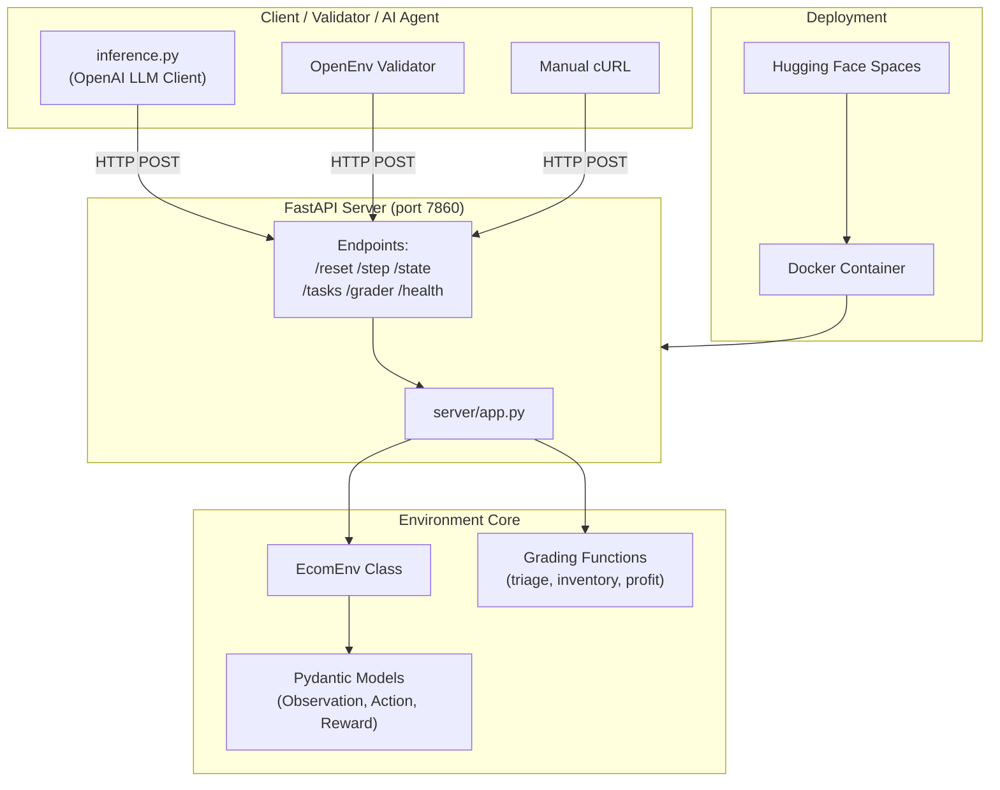
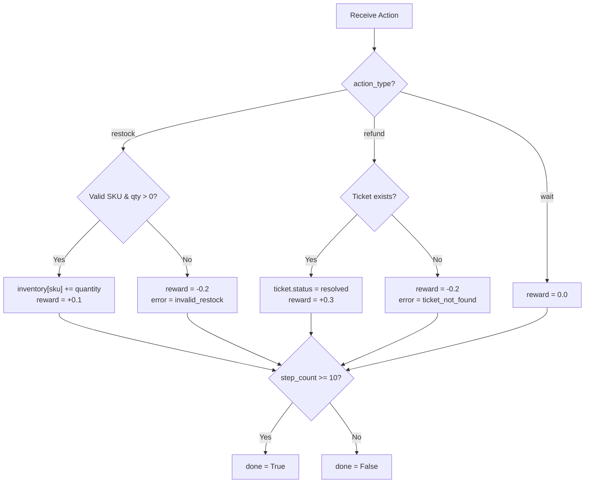
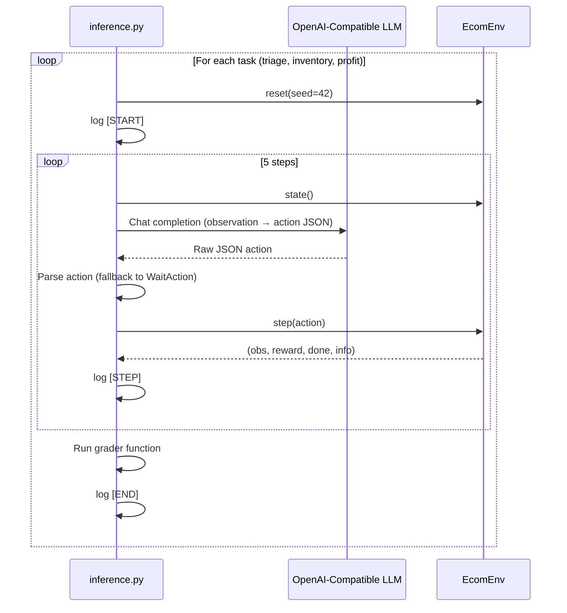

# Swiftlogic E-Commerce Agent Environment — Comprehensive Project Report

> **Project Name:** `commerce-ops-v1` · **Version:** 1.0.0  
> **Hackathon:** Meta × Scaler OpenEnv Hackathon  
> **Framework:** OpenEnv v0.2.3  
> **Date:** April 2026  

---

## Table of Contents

1. [Problem Statement](#1-problem-statement)
2. [Solution Overview](#2-solution-overview)
3. [Architecture & System Design](#3-architecture--system-design)
4. [Repository Structure](#4-repository-structure)
5. [Data Models (Pydantic Schemas)](#5-data-models-pydantic-schemas)
6. [Environment Core — `ecom_env.py`](#6-environment-core--ecom_envpy)
7. [Server & API Layer — `server/app.py`](#7-server--api-layer--serverappppy)
8. [Inference Pipeline — `inference.py`](#8-inference-pipeline--inferencepy)
9. [Grading System](#9-grading-system)
10. [Task Definitions](#10-task-definitions)
11. [Containerization & Deployment](#11-containerization--deployment)
12. [Validation & Testing](#12-validation--testing)
13. [APIs Used](#13-apis-used)
14. [Configuration Files](#14-configuration-files)
15. [Workflow — End-to-End](#15-workflow--end-to-end)
16. [Use Cases](#16-use-cases)
17. [Merits](#17-merits)
18. [Demerits & Limitations](#18-demerits--limitations)
19. [Future Scope](#19-future-scope)
20. [Conclusion](#20-conclusion)

---

## 1. Problem Statement

Modern e-commerce operations involve a complex interplay of **inventory management**, **customer support**, and **financial optimization**. Human operators struggle to make optimal decisions across all three simultaneously, especially under time constraints.

**The core challenge:** Can an autonomous AI agent operate a digital storefront — managing inventory, resolving customer tickets, and maximizing profit — better than a naive strategy, within a fixed decision horizon?

This project was built for the **Meta × Scaler OpenEnv Hackathon**, which requires participants to create standardized reinforcement learning (RL) environments that:

- Conform to the **OpenEnv v0.2.3 specification**
- Expose a deterministic HTTP API for automated evaluation
- Include multi-difficulty grading tasks
- Run inside a Docker container on **Hugging Face Spaces** (≤ 2 vCPU, 8 GB RAM)

---

## 2. Solution Overview

**Commerce Ops v1** is a lightweight, deterministic RL environment that simulates a real-world e-commerce storefront (themed around an ethnic wear brand, *Siyaani*). An AI agent must make sequential decisions across a 10-step "business cycle" to:

| Goal | Mechanism |
|------|-----------|
| **Maintain reputation** | Resolve customer support tickets via `RefundAction` |
| **Manage supply chain** | Keep stock levels healthy via `RestockAction` |
| **Maximize profit** | Preserve and grow a limited `bank_balance` |

The environment is evaluated across **three difficulty tiers** (Easy, Medium, Hard) with deterministic grading functions that return continuous scores in the `(0.01, 0.99)` range.

---

## 3. Architecture & System Design



### Layer Breakdown

| Layer | Component | Purpose |
|-------|-----------|---------|
| **Data Layer** | Pydantic Models | Schema validation, serialization, type safety |
| **Logic Layer** | `EcomEnv` class | State management, action processing, reward calculation |
| **Evaluation Layer** | Grading functions | Task-specific scoring against initial/final states |
| **API Layer** | FastAPI server | HTTP interface for OpenEnv framework compatibility |
| **Inference Layer** | `inference.py` | LLM-driven agent loop with structured logging |
| **Deployment Layer** | Docker + HF Spaces | Containerized cloud deployment |

---

## 4. Repository Structure

```
d:\CMS\
├── ecom_env.py              # Core environment: models, env class, graders
├── inference.py             # LLM inference loop with structured logging
├── server/
│   ├── __init__.py          # Package marker
│   └── app.py               # FastAPI HTTP server (6 endpoints)
├── openenv.yaml             # OpenEnv framework configuration
├── pyproject.toml           # Python project metadata & dependencies
├── requirements.txt         # Pip dependencies
├── Dockerfile               # Container build instructions
├── validate-submission.sh   # Pre-submission validation script
├── test_env.py              # Quick smoke test against live deployment
├── openenv_path.txt         # Local dev helper (OpenEnv install path)
├── .gitignore               # Git exclusions
├── .dockerignore            # Docker build exclusions
├── README.md                # Project documentation
└── uv.lock                  # UV package manager lockfile
```

**Total source files:** 7 Python files + 5 config/support files  
**Total codebase size:** ~17 KB of source code (excluding lockfile)

---

## 5. Data Models (Pydantic Schemas)

All models are defined in `ecom_env.py` using **Pydantic v2** with strict type validation.

### 5.1 `Ticket`

```python
class Ticket(BaseModel):
    ticket_id: str       # e.g., "TKT-001"
    issue_type: str      # e.g., "refund"
    status: str          # "open" or "resolved"
```

### 5.2 `EcomObservation` (State Space)

| Field | Type | Initial Value | Description |
|-------|------|---------------|-------------|
| `current_day` | `int` | `1` | Current simulation day |
| `step_count` | `int` | `0` | Actions taken so far |
| `bank_balance` | `float` | `1000.0` | Cash on hand ($) |
| `inventory` | `Dict[str, int]` | `{"silk_kurta": 50, "cotton_set": 30}` | SKU stock levels |
| `pending_orders` | `Dict[str, int]` | `{"silk_kurta": 5, "cotton_set": 3}` | Awaiting fulfillment |
| `active_tickets` | `List[Ticket]` | `[TKT-001 (open)]` | Support tickets |
| `daily_sales` | `Dict[str, int]` | `{"silk_kurta": 0, "cotton_set": 0}` | Today's sales |
| `active_ad_spend` | `Dict[str, float]` | `{"silk_kurta": 0.0, "cotton_set": 0.0}` | Ad budgets |
| `reward` | `float` | `0.0` | Last step reward |
| `done` | `bool` | `False` | Episode termination flag |

### 5.3 Action Space (Discriminated Union)

```python
class EcomAction(RootModel):
    root: Union[RestockAction, RefundAction, WaitAction]  # discriminator="action_type"
```

| Action | Fields | JSON Example |
|--------|--------|-------------|
| `RestockAction` | `sku: str`, `quantity: int` | `{"action_type": "restock", "sku": "silk_kurta", "quantity": 10}` |
| `RefundAction` | `ticket_id: str` | `{"action_type": "refund", "ticket_id": "TKT-001"}` |
| `WaitAction` | *(none)* | `{"action_type": "wait"}` |

> **Design Decision:** Uses Pydantic's `RootModel` with `Field(discriminator="action_type")` to enable type-safe polymorphic deserialization from flat JSON.

### 5.4 `EcomReward`

```python
class EcomReward(BaseModel):
    value: float  # Single scalar reward
```

---

## 6. Environment Core — `ecom_env.py`

### 6.1 `EcomEnv` Class

The central simulation engine. Implements the standard RL environment interface.

#### Methods

| Method | Signature | Purpose |
|--------|-----------|---------|
| `__init__` | `()` | Auto-calls `reset()` to initialize |
| `seed` | `(seed: int)` | Sets `random.seed()` for determinism |
| `reset` | `(seed: int = None) → EcomObservation` | Resets to initial state |
| `step` | `(action: EcomAction) → (obs, reward, done, info)` | Executes one action |
| `state` | `() → EcomObservation` | Returns current observation |
| `reset_async` | `(seed, **kwargs)` | Async wrapper (OpenEnv compliance) |
| `step_async` | `(action, **kwargs)` | Async wrapper (OpenEnv compliance) |
| `close` | `()` | Cleanup (no-op) |

#### Step Logic (Action Processing)



#### Reward Table

| Outcome | Reward | Rationale |
|---------|--------|-----------|
| Successful restock | `+0.1` | Modest reward for supply chain maintenance |
| Successful refund | `+0.3` | Higher reward for customer satisfaction |
| Wait (no-op) | `0.0` | Neutral — no action taken |
| Invalid action | `−0.2` | Penalty for hallucinated/invalid actions |

---

## 7. Server & API Layer — `server/app.py`

A **FastAPI** application serving the OpenEnv HTTP interface on port **7860**.

### 7.1 Endpoints

| Method | Path | Purpose | Request Body | Response |
|--------|------|---------|-------------|----------|
| `GET` | `/` | Service info | — | Status, version, available endpoints |
| `GET` | `/health` | Health check | — | `{"status": "ok"}` |
| `POST` | `/reset` | Reset environment | `{"seed": 42}` (optional) | `{observation, reward, done}` |
| `POST` | `/step` | Execute action | Flat or wrapped action JSON | `{observation, reward, done, info}` |
| `GET` | `/state` | Current observation | — | `{observation}` |
| `GET` | `/tasks` | List task definitions | — | Array of task objects |
| `POST` | `/grader` | Run all graders | — | `{scores: [{task_id, score, grader}]}` |

### 7.2 Flat JSON Compatibility

The `/step` endpoint accepts **both** formats for hackathon validator compatibility:

```python
action_data = body.get("action", body)  # Unwrap if wrapped, use as-is if flat
```

- **Flat:** `{"action_type": "wait"}`
- **Wrapped:** `{"action": {"action_type": "wait"}}`

### 7.3 State Management

- A global `env = EcomEnv()` instance persists across requests
- `_initial_state` is captured on each `/reset` call for grading comparison
- The `/grader` endpoint compares `_initial_state` vs. current `env.state()`

---

## 8. Inference Pipeline — `inference.py`

### 8.1 Purpose

Drives an **LLM-powered agent** through the environment, producing structured logs for OpenEnv evaluation.

### 8.2 Architecture



### 8.3 Structured Logging Format

```
[START] task=triage_task env=commerce_ops_v1 model=mistral-7b
[STEP] step=1 action=refund reward=0.30 done=false error=null
[STEP] step=2 action=wait reward=0.00 done=false error=null
...
[END] success=true steps=5 score=0.70 rewards=0.30,0.00,... graders=triage_task:0.99
```

### 8.4 Error Handling

- LLM response parsing failures → fallback to `WaitAction()`
- Unknown action types → fallback to `WaitAction()`
- Scores clamped to `(0.01, 0.99)` range

---

## 9. Grading System

Three deterministic grading functions, each accepting `(initial_state, final_state)` and returning a float in `(0.01, 0.99)`.

### 9.1 `grade_triage_task` — Easy

```
score = resolved_tickets / total_tickets
clamped to (0.01, 0.99)
```

**What it tests:** Can the agent identify and resolve all open customer support tickets?

### 9.2 `grade_inventory_task` — Medium

```
score = cotton_set_stock / 10.0
clamped to (0.01, 0.99)
```

**What it tests:** Can the agent maintain target stock levels (10 units of `cotton_set`)?

### 9.3 `grade_profit_task` — Hard

```
profit = final_balance - initial_balance
score = 0.5 + (profit / 400.0)
clamped to (0.01, 0.99)
```

**What it tests:** Can the agent grow the bank balance beyond the $1,000 seed capital?

> [!IMPORTANT]
> All graders intentionally avoid returning exactly `0.0` or `1.0` to satisfy the OpenEnv Phase 2 Deep Validation requirements.

### 9.4 Baseline Performance (Mistral-7B, Zero-Shot)

| Task | Difficulty | Baseline Score | Analysis |
|------|-----------|---------------|----------|
| Ticket Triage | Easy | 0.99 | Resolves ticket consistently; capped by safety buffer |
| Inventory Health | Medium | 0.40 | Struggles to balance stock costs with revenue |
| Profit Maximization | Hard | 0.10 | Fails to generate positive margin over 10 steps |

---

## 10. Task Definitions

Defined in `openenv.yaml` and mirrored in `server/app.py`:

```yaml
tasks:
  - id: triage_task
    name: "Customer Ticket Triage"
    difficulty: easy
    grader:
      module: ecom_env
      function: grade_triage_task

  - id: inventory_task
    name: "Inventory Management"
    difficulty: medium
    grader:
      module: ecom_env
      function: grade_inventory_task

  - id: profit_task
    name: "Profit Maximization"
    difficulty: hard
    grader:
      module: ecom_env
      function: grade_profit_task
```

---

## 11. Containerization & Deployment

### 11.1 Dockerfile

```dockerfile
FROM python:3.11-slim
WORKDIR /app
COPY . /app
RUN pip install --no-cache-dir fastapi uvicorn pydantic>=2.0.0 openai openenv-core
ENV PYTHONPATH="/app"
EXPOSE 7860
CMD ["uvicorn", "server.app:app", "--host", "0.0.0.0", "--port", "7860"]
```

**Key decisions:**
- `python:3.11-slim` — minimal image size (~150 MB)
- `PYTHONPATH="/app"` — ensures `ecom_env` is importable from server package
- Port `7860` — required by Hugging Face Spaces

### 11.2 Deployment Target

- **Platform:** Hugging Face Spaces (Docker SDK)
- **URL:** `https://swiftlogic-e-commerce-agent.hf.space`
- **Resources:** ≤ 2 vCPU, 8 GB RAM
- **HF Space metadata** (in `README.md` frontmatter):

```yaml
title: E-commerce Agent Env
sdk: docker
app_port: 7860
tags: [openenv]
```

### 11.3 `.dockerignore`

Excludes `.venv`, `__pycache__`, `.git`, `.env`, and compiled Python files to minimize image size.

---

## 12. Validation & Testing

### 12.1 `validate-submission.sh`

A 3-step automated validation script:

| Step | Check | Tool |
|------|-------|------|
| 1/3 | Validate CLI arguments (HF URL format, repo directory exists) | Bash |
| 2/3 | Docker build succeeds within 600s timeout | `docker build` |
| 3/3 | `openenv validate` passes | `openenv-core` CLI |

### 12.2 `test_env.py`

Quick smoke test against the live HF Space:

```python
requests.post(f"{url}/reset", json={})    # → 200
requests.post(f"{url}/step", json={"action_type": "wait"})  # → 200
requests.get(f"{url}/state")              # → 200
```

---

## 13. APIs Used

### 13.1 External APIs

| API | Library | Purpose | Auth |
|-----|---------|---------|------|
| **OpenAI Chat Completions** | `openai` Python SDK | LLM inference for agent decisions | `HF_TOKEN` or `API_KEY` env var |

**Configuration:**
- `API_BASE_URL` — custom base URL (for HF Inference Endpoints or local models)
- `MODEL_NAME` — model identifier (default: `"default-model"`)
- `response_format={"type": "json_object"}` — enforced structured JSON output

### 13.2 Internal APIs (Self-Hosted)

| Endpoint | Method | Purpose |
|----------|--------|---------|
| `/reset` | POST | Initialize environment state |
| `/step` | POST | Execute agent action |
| `/state` | GET | Retrieve current observation |
| `/tasks` | GET | List available evaluation tasks |
| `/grader` | POST | Run all grading functions |
| `/health` | GET | Liveness probe |
| `/` | GET | Service metadata |

### 13.3 Framework APIs

| Framework | Version | Purpose |
|-----------|---------|---------|
| **OpenEnv** | ≥ 0.2.1 | RL environment specification & validation |
| **FastAPI** | Latest | HTTP server framework |
| **Pydantic** | ≥ 2.0.0 | Data validation & serialization |
| **Uvicorn** | Latest | ASGI server |

---

## 14. Configuration Files

### 14.1 `pyproject.toml`

```toml
[project]
name = "commerce-ops-v1"
version = "1.0.0"
requires-python = ">=3.10"
dependencies = [
    "openenv-core>=0.2.1",
    "pydantic>=2.0.0",
    "openai",
    "requests",
    "uvicorn",
    "fastapi"
]

[project.scripts]
server = "server.app:main"
```

### 14.2 `openenv.yaml`

Defines the environment for the OpenEnv framework: name, runtime (Docker), app entrypoint, port, and all three task+grader mappings.

### 14.3 `requirements.txt`

Flat dependency list for `pip install -r` compatibility:
`openenv-core`, `pydantic>=2.0.0`, `openai`, `requests`, `uvicorn`, `fastapi`

---

## 15. Workflow — End-to-End

```mermaid
flowchart LR
    subgraph Development
        A[Define Pydantic Models] --> B[Implement EcomEnv]
        B --> C[Write Grading Functions]
        C --> D[Build FastAPI Server]
        D --> E[Write Inference Script]
    end

    subgraph Validation
        E --> F[Run test_env.py]
        F --> G[Run validate-submission.sh]
    end

    subgraph Deployment
        G --> H[Docker Build]
        H --> I[Push to HF Spaces]
        I --> J[OpenEnv Validator Runs]
        J --> K[Scores Published]
    end
```



### Step-by-Step

1. **Model Definition** — Pydantic schemas enforce strict typing for observations, actions, and rewards
2. **Environment Implementation** — `EcomEnv` manages state transitions and reward calculation
3. **Grader Development** — Three deterministic functions score agent performance per task
4. **Server Creation** — FastAPI wraps the environment with HTTP endpoints
5. **Inference Script** — LLM agent iterates through all tasks with structured logging
6. **Local Testing** — Smoke tests verify endpoint connectivity
7. **Validation** — `validate-submission.sh` checks Docker build + OpenEnv compliance
8. **Deployment** — Docker image pushed to Hugging Face Spaces
9. **Evaluation** — OpenEnv hackathon validator hits the live API and records scores

---

## 16. Use Cases

| Use Case | Description |
|----------|-------------|
| **RL Benchmarking** | Evaluate RL/LLM agents on multi-objective e-commerce optimization |
| **LLM Agent Testing** | Test whether language models can produce valid structured actions from observations |
| **Educational Tool** | Teach RL concepts (state, action, reward, episode) in a business context |
| **Hackathon Submission** | Standardized environment for the Meta × Scaler OpenEnv competition |
| **Agent Comparison** | Compare different models (GPT-4, Mistral, Llama) on the same deterministic tasks |
| **Curriculum Learning Research** | Easy → Medium → Hard task progression for agent training |

---

## 17. Merits

| Merit | Detail |
|-------|--------|
| **Deterministic & Reproducible** | Seeded `random` ensures identical runs for fair benchmarking |
| **Lightweight** | Runs within 2 vCPU / 8 GB RAM; ~150 MB Docker image |
| **Type-Safe** | Pydantic v2 with discriminated unions prevents invalid actions at the schema level |
| **Framework Compliant** | Fully adheres to OpenEnv v0.2.3 spec (async methods, task/grader API contract) |
| **Dual JSON Format** | Accepts both flat and wrapped action JSON for maximum compatibility |
| **Continuous Scoring** | Graders return `(0.01, 0.99)` — never binary — enabling fine-grained agent comparison |
| **Multi-Difficulty Tasks** | Easy/Medium/Hard tiers test different agent capabilities |
| **Clean Architecture** | Separation of concerns: models → env → graders → server → inference |
| **Production-Ready Deployment** | Dockerized, deployed on Hugging Face Spaces with health checks |
| **Structured Logging** | `[START]`, `[STEP]`, `[END]` format enables automated log parsing |
| **Error Resilience** | LLM failures gracefully fall back to `WaitAction` instead of crashing |
| **Minimal Dependencies** | Only 6 Python packages required |

---

## 18. Demerits & Limitations

| Demerit | Detail |
|--------|--------|
| **Static Initial State** | Every reset produces the same state (1 ticket, 2 SKUs) — limited diversity |
| **No Stochastic Dynamics** | No random customer arrivals, demand fluctuations, or market events |
| **Single Ticket** | Only 1 support ticket (`TKT-001`) — trivially solvable for triage task |
| **No Financial Mechanics** | Restocking doesn't deduct from `bank_balance` — profit task is hard to differentiate |
| **Fixed Episode Length** | Always 10 steps — no early termination on bankruptcy or success |
| **No Multi-Agent Support** | Single-agent environment only |
| **Limited Action Space** | Only 3 action types — real e-commerce has pricing, marketing, sourcing, etc. |
| **No Persistent Storage** | Server state is in-memory — restarts lose all progress |
| **No Authentication** | API endpoints are publicly accessible with no auth |
| **Inference Hardcoded to 5 Steps** | `inference.py` runs only 5 of the 10 possible steps |
| **No Unit Test Suite** | Only a smoke test (`test_env.py`) — no pytest/unittest coverage |
| **Global Mutable State** | Single `env` instance in `server/app.py` — not thread-safe for concurrent requests |

---

## 19. Future Scope

### Short-Term Improvements

| Enhancement | Impact |
|-------------|--------|
| **Dynamic ticket generation** | Multiple tickets spawned per episode for realistic triage |
| **Restock cost deduction** | `bank_balance -= unit_cost * quantity` for meaningful profit optimization |
| **Stochastic demand model** | Random daily sales based on ad spend and seasonality |
| **Full 10-step inference** | Align `inference.py` with the environment's actual episode length |
| **Comprehensive test suite** | pytest with edge cases, invalid inputs, and grader boundary tests |

### Medium-Term Enhancements

| Enhancement | Impact |
|-------------|--------|
| **Multi-SKU scaling** | 10–50 products with varying margins, demand curves, and lead times |
| **Pricing actions** | Dynamic pricing as a new action type affecting demand elasticity |
| **Ad campaign actions** | Allocate ad spend to influence `daily_sales` stochastically |
| **Customer satisfaction model** | Track cumulative satisfaction score affecting long-term revenue |
| **Multi-episode training** | Support for RL training loops with thousands of episodes |
| **WebSocket streaming** | Real-time observation streaming for interactive dashboards |

### Long-Term Vision

| Enhancement | Impact |
|-------------|--------|
| **Multi-agent marketplace** | Multiple competing stores in a shared economy |
| **Supply chain simulation** | Supplier lead times, shipping delays, warehouse capacity |
| **Real data integration** | Historical e-commerce datasets (Shopify, WooCommerce) for realistic initialization |
| **Visual dashboard** | React/Next.js frontend showing live agent decisions and metrics |
| **Transfer learning benchmark** | Pre-train on easy tasks, evaluate transfer to hard tasks |
| **Human-in-the-loop mode** | Allow human operators to compete against or collaborate with AI agents |

---

## 20. Conclusion

**Commerce Ops v1** delivers a clean, deterministic, and framework-compliant RL environment for autonomous e-commerce operations. It successfully satisfies all OpenEnv v0.2.3 requirements — including task definitions, grading functions, HTTP API endpoints, and containerized deployment on Hugging Face Spaces.

The project demonstrates a well-structured separation of concerns across data models, environment logic, evaluation, API serving, and inference. While the current version is intentionally simple (2 SKUs, 1 ticket, 3 action types), it provides a solid foundation for scaling into a comprehensive e-commerce simulation platform.

**Key Technical Achievement:** End-to-end LLM agent evaluation pipeline — from structured observation → OpenAI API call → action parsing → environment step → deterministic grading — all within a single, reproducible, containerized system.

---

> *Generated on April 20, 2026 — Comprehensive technical report for the Swiftlogic E-Commerce Agent Environment (commerce-ops-v1)*
