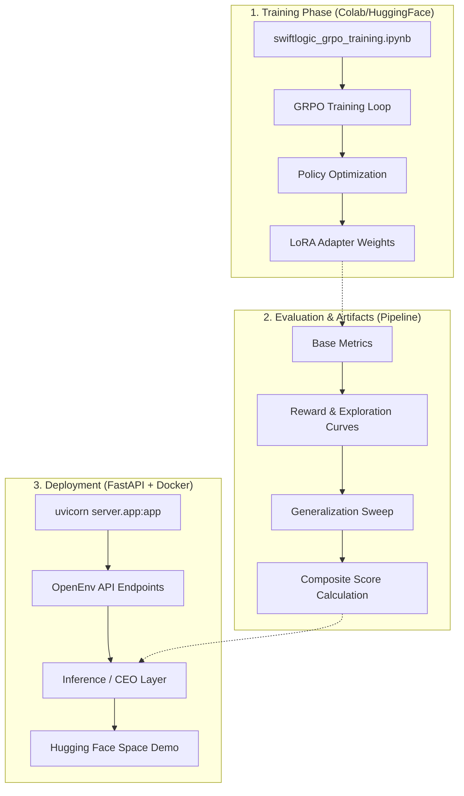

# 🏭 Swiftlogic CommerceOps v2: Autonomous AI Startup Operator

**[▶️ Play with the Demo on Hugging Face Space](https://huggingface.co/spaces/Swiftlogic/E-commerce-agent)**

*(See below for [Presentation Slides](#), [Video Walkthrough](#), and [Blog Post](#))*

---

## 🛑 The Problem: What Capability Gap Are We Targeting?

Modern LLMs are excellent at single-step API calls and short-context reasoning, but they struggle with **long-horizon planning under uncertainty**. When decisions have delayed systemic consequences, models often fail. 

In the real world of e-commerce, decisions that look locally correct (e.g., aggressively discounting prices, delaying restocks to save cash, skipping refunds) create delayed, systemic failures: sudden stockouts, cash crunches, insurmountable ticket backlogs, collapsing customer satisfaction, and eventual bankruptcy. 

**Is this domain underexplored in RL/LLM training?** Yes. Most RL environments for LLMs focus on coding, web navigation, or simple games. Business operations—where an agent must balance conflicting multi-objective goals (profit vs. service quality vs. inventory health) across a stochastic, delayed-effect environment—is a massively underexplored frontier. 

**Does this teach an LLM something it can't do well?** Absolutely. CommerceOps v2 forces the model to learn resource-constrained, multi-objective optimization over a 50-day horizon.

## 🌍 The Environment: What Does the Agent See, Do, and Get Rewarded For?

Swiftlogic CommerceOps v2 is a deterministic OpenEnv environment where a single policy must operate an e-commerce storefront for a 50-day simulated quarter.

**What the Agent Sees (Observation):**
A structured snapshot of the business. The agent sees its bank balance, current inventory, pending deliveries, active support tickets with varying urgencies, competitor prices, and active supplier quotes. 

**What the Agent Does (Actions):**
Every day, the agent takes one of six actions:
1. `restock`: Buy inventory (navigating lead times and partial-fills).
2. `refund`: Resolve a customer support ticket.
3. `ad_spend`: Allocate marketing budget to boost demand.
4. `negotiate`: Request quotes from suppliers to get volume discounts.
5. `set_price`: Adjust product prices to compete in the market.
6. `wait`: Do nothing and let the day advance.

**What It Gets Rewarded For (Reward Engine):**
The environment provides a dense, 8-term reward signal. The agent is rewarded for booking revenue, maintaining solvency, and hitting inventory targets. It is heavily penalized for stockouts, letting urgent tickets age, making invalid actions, and going bankrupt. 

To prevent reward hacking, the environment features realistic physics: Poisson-distributed stochastic demand, reactive competitors that undercut prices, market shocks, and customer satisfaction decay.

## 📈 Results: What Changed After Training?

We trained a baseline **Qwen2.5-0.5B-Instruct** model using GRPO (Group Relative Policy Optimization) on this environment. 

**Before Training (Zero-Shot Baseline):**
- **Profit Maximization:** ~15% success. The zero-shot model frequently went bankrupt, undershot revenue, or hoarded cash while ignoring stockouts.
- **Inventory Health:** ~40%.
- **Ticket Triage:** ~80%.

**After GRPO Training:**
The agent learned to stabilize the business. It stopped reactive over-ordering, began negotiating before restocking, and maintained enough cash buffer to survive market shocks. 
- **Composite Score Improvement:** `0.61 -> 0.66 (+9%)` across unseen evaluation tasks.
- The model successfully generalizes to unseen business configs (e.g., swapping from a fashion store to a pharmacy or a SaaS business).

**Key Artifacts:**
- 📈 **[Reward Curve](artifacts/reward_curve.png)**: Shows steady policy improvement over training steps.
- 📉 **[Exploration Curve](artifacts/exploration_curve.png)**: Demonstrates the model narrowing in on a winning business strategy.
- 📊 **[Before/After Comparison](artifacts/before_after_comparison.png)**: Visualizes the dramatic reduction in bankruptcy rates and increase in profit.
- 🧠 **[Failure vs Recovery](artifacts/failure_vs_recovery.png)**: Shows how the trained agent recovers from the exact same market shock that bankrupted the baseline.

## 🔬 Why Does It Matter? (Could you write a paper on this?)

**Who cares, and why?**
- **AI Researchers:** CommerceOps v2 is a rigorous benchmark for multi-agent interaction, world modeling, and generalization. It is highly suitable for a research paper on RL-driven LLM alignment.
- **Enterprise Operators:** It proves that LLMs can be trained to operate not just as chatbots, but as autonomous business controllers. 

The environment includes a built-in **CEO Layer** that generates step-by-step causal explanations (e.g., "The agent chose to wait because it wanted to maintain balance, despite a slight revenue downtrend"). This makes the agent's decisions fully auditable and judge-ready, bridging the gap between black-box RL and enterprise explainability requirements.

## ⚙️ Pipeline & Architecture

### 🔄 System Workflow
The Swiftlogic CommerceOps v2 pipeline is designed for reproducible research and autonomous deployment. It bridges the gap between high-scale RL training and explainable enterprise operations.



## 🚀 Quick Start for Reviewers

A reviewer can read this and run the environment in under 5 minutes.

**1. Clone and Install**
```bash
git clone https://github.com/Swiftlogic/CommerceOps-v2.git && cd CommerceOps-v2
pip install -r requirements.txt
```

**2. Run the Test Suite (218+ passing tests)**
```bash
pytest -q
```

**3. Run the Full Pipeline (Generates all artifacts in ~2 mins)**
```bash
python scripts/run_full_pipeline.py --fast-mode
```

**4. Start the Environment API**
```bash
uvicorn server.app:app --host 0.0.0.0 --port 7860
```

**5. See the Agent in Action (Demo Mode)**
Watch the CEO-layer narrate a full 50-day business cycle:
```bash
COMMERCEOPS_DEMO_MODE=1 API_BASE_URL=<openai-compatible-endpoint> MODEL_NAME=<id> python inference.py
```

### 📚 Additional References
- github repo link - https://github.com/Rehan-2024/Swiftlogic-Ecom-Agent
- 🌐 [Hugging Face Space](https://huggingface.co/spaces/Swiftlogic/E-commerce-agent)
- 📓 [Colab Training Notebook](https://colab.research.google.com/drive/1SL0WNISJ7zv7foylB1C3uzrExudOTAzs?usp=sharing/CommerceOps-v2/blob/feature/training/swiftlogic_grpo_training.ipynb)
- 📖 [Full Technical Project Report](PROJECT_REPORT.md)
- 🎥 *[Video Walkthrough]* (https://youtu.be/DQRRnoEToWg?si=G1TVjQFnrUjfXHHw)


