# CommerceOps v2 Full Fix Plan

## Guardrails (Must Preserve)

- Keep endpoint shapes and semantics for `POST /reset`, `POST /step`, `GET /state`, `GET /tasks`, `POST /grader` in [d:\CMS\server\app.py](d:\CMS\server\app.py).
- Keep `EcomAction` as discriminated union `RootModel[Annotated[Union[...], Field(discriminator="action_type")]]` in [d:\CMS\ecom_env.py](d:\CMS\ecom_env.py).
- Keep backward-compatible observation serialization (new fields must stay defaulted).
- Keep grader outputs strictly clamped to `(0.01, 0.99)`.

## Phase 1 — API Hardening and OpenEnv Safety (Critical/High)

### 1.1 Harden request parsing and validation paths

- File: [d:\CMS\server\app.py](d:\CMS\server\app.py)
- Add defensive handling for malformed/non-dict JSON in `/step`, `/reset`, and `/config`.
- Catch Pydantic validation failures for action models and return stable 4xx JSON responses (not 500s), without changing success response shape.
- Ensure both flat and wrapped action formats remain accepted.

### 1.2 Secure `/config` business selector

- File: [d:\CMS\server\app.py](d:\CMS\server\app.py)
- Replace path interpolation trust with allowlist/strict regex validation of `business_id`.
- Restrict to known config IDs discoverable from `configs/*.json`.
- Keep 404 behavior for unknown valid-form IDs to remain client-friendly.

### 1.3 Concurrency containment for singleton environment

- File: [d:\CMS\server\app.py](d:\CMS\server\app.py)
- Introduce a synchronization strategy around mutable globals (`env`, `_initial_state`) for thread-safe request handling.
- Prefer minimal locking around state-changing handlers (`/reset`, `/step`, `/config`, `/grader`).
- Keep API payloads unchanged; only internal consistency behavior changes.

## Phase 2 — Architecture and Module Integrity (High/Medium)

### 2.1 Centralize action parsing/dispatch mapping

- Files:
  - [d:\CMS\server\app.py](d:\CMS\server\app.py)
  - [d:\CMS\ecom_env.py](d:\CMS\ecom_env.py)
- Create one internal action-factory mapping in server layer to reduce branch drift as actions evolve.
- Maintain explicit model construction per action for predictable validation.

### 2.2 Strengthen config validation

- File: [d:\CMS\env\world_engine.py](d:\CMS\env\world_engine.py)
- Extend `_validate_config` with value checks:
  - non-negative `unit_cost`, `sell_price`, `initial_stock`
  - positive/non-empty `seasonality_weights`
  - sane bounds for reward coefficients and action caps
  - allowed action name checks against known action types.
- Preserve current required-key checks and error style.

## Phase 3 — Environment Physics and Supplier Mechanics (High/Medium)

### 3.1 Fix supplier hot-swap parameter refresh

- File: [d:\CMS\env\world_engine.py](d:\CMS\env\world_engine.py)
- On each `load_config`/`_build_lookup_tables`, refresh all supplier tunables (`volume_free_units`, `volume_rate`, `demand_rate`) in addition to base prices.
- Keep current quote flow and one-shot quote consumption semantics unchanged.

### 3.2 Validate and document quote lifecycle edge behavior

- Files:
  - [d:\CMS\env\world_engine.py](d:\CMS\env\world_engine.py)
  - [d:\CMS\PROJECT_REPORT.md](d:\CMS\PROJECT_REPORT.md)
  - [d:\CMS\README.md](d:\CMS\README.md)
- Confirm behavior for:
  - overwrite on repeated negotiate for same SKU
  - persistence until successful restock
  - no clear on insufficient funds.
- Keep behavior; improve explicitness in docs and tests.

### 3.3 Plan either implementation or deprecation of dead physics fields

- Files:
  - [d:\CMS\env\world_engine.py](d:\CMS\env\world_engine.py)
  - [d:\CMS\configs\siyaani_fashion.json](d:\CMS\configs\siyaani_fashion.json)
  - [d:\CMS\configs\medplus_pharmacy.json](d:\CMS\configs\medplus_pharmacy.json)
  - [d:\CMS\configs\stackbase_saas.json](d:\CMS\configs\stackbase_saas.json)
- Decide one of two non-breaking paths:
  - implement `restock_lead_days`/`pending_orders` delayed fulfillment pipeline, or
  - formally mark these as metadata/non-operative and remove misleading claims from docs.

### 3.4 Add quote expiration to prevent stale negotiated pricing

- File: [d:\CMS\env\world_engine.py](d:\CMS\env\world_engine.py)
- Add per-SKU quote TTL metadata using `quote_expiry_step = step_count + 3` at negotiate time.
- On restock, ignore and clear quote when `step_count > quote_expiry_step`; fallback to list cost.
- Keep one-shot quote consumption semantics unchanged for unexpired quotes.

## Phase 4 — Demand and Reward Stability (Medium)

### 4.1 Defend against invalid seasonality arrays

- File: [d:\CMS\env\demand_model.py](d:\CMS\env\demand_model.py)
- Add safe fallback when `seasonality_weights` is empty or malformed.
- Preserve current Poisson-based stochastic behavior and inventory caps.

### 4.2 Rebalance reward composition for RL stability

- File: [d:\CMS\env\reward_engine.py](d:\CMS\env\reward_engine.py)
- Reduce double counting between `revenue_multiplier` and `bank_balance_delta_weight` via coefficient policy.
- Add explicit handling for currently unused `ad_roi_positive` (implement or deprecate).
- Extend ticket-aging penalty logic to include `critical` urgency with configurable weighting.

### 4.3 Smooth demand signal and cap supplier quote price

- Files:
  - [d:\CMS\env\world_engine.py](d:\CMS\env\world_engine.py)
  - [d:\CMS\env\supplier_agent.py](d:\CMS\env\supplier_agent.py)
- Replace single-day `daily_sales / base_demand` demand signal with 3-day rolling mean:
  - `recent = mean(last_3_sales)` and `signal = recent / base_demand`.
- Add supplier hard cap to prevent quote blowups:
  - `quote = min(raw_quote, base_price * 2.5)`.
- Preserve existing monotonic premium behavior below cap.

## Phase 5 — Training Harness Alignment (Medium/Minor)

### 5.1 Update inference action support

- File: [d:\CMS\inference.py](d:\CMS\inference.py)
- Add `negotiate` action parsing and prompt schema entry to match live environment action space.
- Keep fallback-to-wait behavior for parser failures.

### 5.2 Add evaluation diagnostics for negotiation behavior

- File: [d:\CMS\inference.py](d:\CMS\inference.py)
- Log negotiate usage rate and quote-to-restock conversion metrics for policy debugging.

## Phase 6 — Test Matrix and Regression Protection (Critical)

### 6.1 Add endpoint contract tests

- New test files under `tests/` (e.g., API contract and action validation suites).
- Validate:
  - endpoint shapes for required OpenEnv routes
  - flat/wrapped action formats
  - unknown action handling
  - malformed payload resilience (no 500s).

### 6.2 Add simulation invariants tests

- Validate:
  - inventory never negative
  - bank balance transitions consistent with action + daily simulation
  - done conditions for horizon/bankruptcy.

### 6.3 Add supplier-flow tests

- Validate:
  - quote creation
  - quote overwrite behavior
  - quote expiry after TTL (`negotiate -> wait x4 -> restock` must ignore stale quote)
  - quote consumption on successful restock
  - quote persistence after insufficient funds
  - fallback to list cost without quote
  - supplier quote cap enforcement at high quantity (`<= base_price * 2.5`)
  - rolling 3-day demand signal influences negotiate pricing predictably.

### 6.4 Add grader-bound sweeps and config hot-swap regression

- For all three configs and multi-seed rollouts, assert grader scores remain within `(0.01, 0.99)`.
- Assert `/config` switching remains stable and action whitelist includes `negotiate`.

## Phase 7 — Documentation and Developer Quality (Minor)

### 7.1 Align docs with runtime behavior

- Files:
  - [d:\CMS\README.md](d:\CMS\README.md)
  - [d:\CMS\PROJECT_REPORT.md](d:\CMS\PROJECT_REPORT.md)
- Update sections describing action space, supplier flow, reward terms, and any non-operative config fields.

### 7.2 Add operations notes for deployment mode

- Document single-session benchmark assumptions vs multi-client serving caveats in README.

## Priority Mapping to Issue Severity

- **Critical first:** API hardening, concurrency containment, regression tests.
- **High second:** `/config` sanitization, supplier hot-swap tunables, architecture dispatch cohesion.
- **Medium third:** reward rebalance, demand fallback safety, dead-physics field decision.
- **Minor last:** docs alignment, richer inference diagnostics.

## Top 10 Improvements Addressed by This Plan

1. Robust 4xx handling for malformed API payloads.
2. Thread-safe handling of global mutable environment state.
3. `/config` input allowlisting and path safety.
4. Full supplier parameter refresh on config swap.
5. Strong config value validation and guardrails.
6. Reward-signal rebalance to improve RL stability.
7. Resolve dead/mechanically-unused fields (`restock_lead_days`, `pending_orders`).
8. Include critical-ticket urgency in reward aging logic.
9. Align inference harness to 5-action environment (including `negotiate`).
10. Durable automated regression suite for OpenEnv compatibility and grader bounds.
11. Prevent stale negotiated pricing with deterministic quote expiration.
12. Stabilize supplier pricing inputs via 3-day demand-signal smoothing.
13. Enforce supplier quote ceiling to avoid unrealistic high-price outliers.

## Execution Flow (Order of Work)

```mermaid
flowchart LR
    phase1ApiHardening[Phase1_ApiHardening] --> phase2Architecture[Phase2_Architecture]
    phase2Architecture --> phase3PhysicsSupplier[Phase3_PhysicsSupplier]
    phase3PhysicsSupplier --> phase4DemandReward[Phase4_DemandReward]
    phase4DemandReward --> phase5TrainingHarness[Phase5_TrainingHarness]
    phase5TrainingHarness --> phase6RegressionTests[Phase6_RegressionTests]
    phase6RegressionTests --> phase7Docs[Phase7_Docs]
```

## Success Criteria

- OpenEnv-required endpoints remain shape-compatible and validator-safe.
- Discriminated union action model remains intact.
- No malformed input path yields uncaught 500 in normal request handling.
- Supplier negotiation lifecycle is deterministic, documented, and covered by tests.
- Supplier quotes expire after bounded TTL, and stale quotes do not affect future restocks.
- Supplier pricing remains stable under demand noise and bounded under high-quantity asks.
- Multi-config, multi-seed sweeps pass with grader bounds preserved.
- Training harness reflects full action space and provides actionable diagnostics.